# Introduction and Word Vectors
*Human language and word meaning*

[Stanford CS224N: NLP with Deep Learning | Winter 2019](https://web.stanford.edu/class/archive/cs/cs224n/cs224n.1194/index.html#schedule)
[video](https://www.youtube.com/watch?v=8rXD5-xhemo&list=PLoROMvodv4rOhcuXMZkNm7j3fVwBBY42z&index=1)

**WordNet Problems**
- missing new meanings of words, impossible to keep up-to-date
- subjective
- requieres human labor to create and adapt

>  can't compute accurate word similarity

**Words as discrete symbols**
In traditional NLP, we regard words as direte symbols, i.e. *localist* representation or *one-hot* vectors:
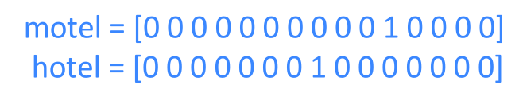
- languages have a lot of words and more keep being added over time
- there is no natural notion of similarity for one-hot vectors.

> Instead: learn to encode similarity in the vectors themselves

**Words by context**
*Distributional semantics:* A word’s meaning is given by the words that frequently appear close-by.

Use the many contexts of word \(w\) to build up a representation of it:
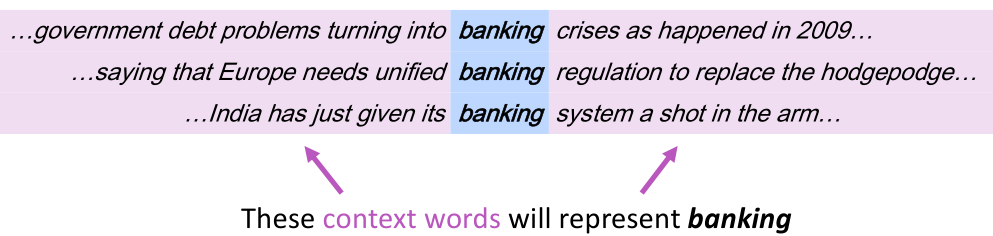
- context is the set of words that appear nearby within a fixed-size window

## Word2vec
### Word vectors
*Distributed representation*

We're still going to represent the meaning of a word as a numeric vector, but now we're going to say that the meaning of each word it's going to be a *dense vector* where by all of the numbers are non-zero:
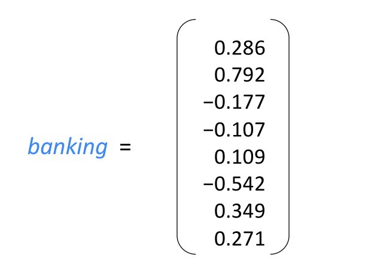

We will build a dense vector for each word, chosen so that it is similar to vectors of words that appear in similar contexts.

> word vectors are sometimes called word embeddings or word representations.

### Word2vec algorithm
*Framework for learning word vectors*

Iterative algorithm where we go through each position in the text, look at the words around it and the meaning of a word is its contexts of use. We want the representation of the word in the middle to be able to predict the words that are around it and so we're gonna achieve that by moving the position of the word vector.

Every word in a fixed vocabulary (large corpus) is represented by a vector, where each position \(t\) in the text has:
- a center word \(w_t\)
- outside context words of fixed window size of \(t\)

Example windows and process for computing \(P(w_{t+j} \vert w_t)\):
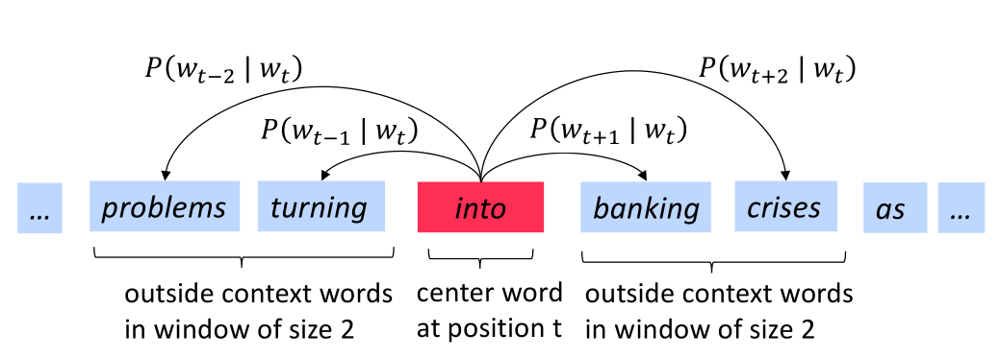
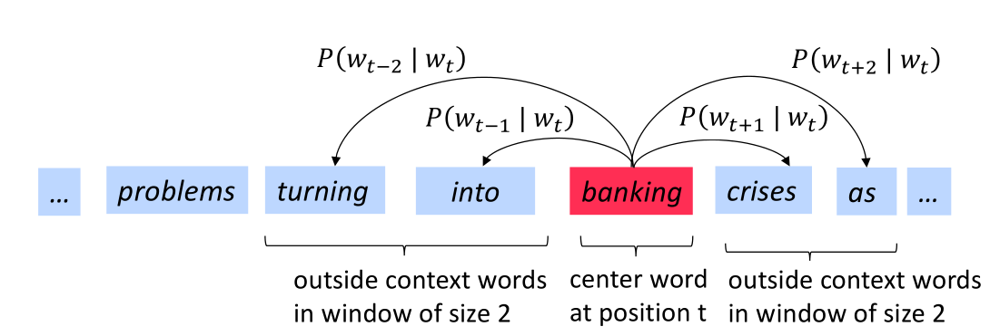

> adjust word vectors to maximize their probability of similarity measured as \(o\) given \(c\) or vice versa.

### Objective function
Our probability model tries to predict \(m\) context words \(w_{t+j}\) given the center word \(w_t\), if we multiply all those things together we obtain our *likelihood*:
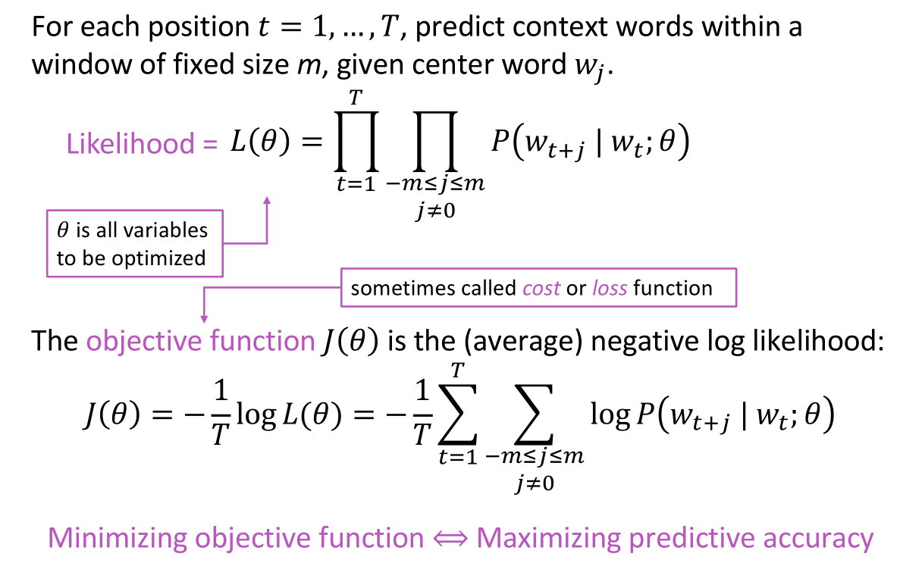

Likelihood is how good are we at predicting the words around every word:
- the first product \(\prod_{t=1}^T\) goes through all the words
- the second product \(\prod_{-m \leq j \leq m, j \neq 0}\) uses fixed size window for each size

We want to come up with vector representations of words \(\theta\) in such a way as to minimize our objective function:
- minus sign so we can do minimization rather than maximization
- scale by average \(\frac{1}{T}\), i.e. things are not dependent on the size of the corpus
- the log allow us to turn products into a sums of the likelihood probability, i.e. *log-likelihood*

> So if we can change our vector representations of these words so as to minimize this J of theta, that means we'll be good at predicting words in the context of another word.

The probability of the context word \(u_w\) given the center word \(v_w\) is expressed in terms of their corresponding vector:
- one kind of vector for the center word \(v_w\)
- and a different vector for context word \(u_w\).

We're basically saying there's one kind of vector for center words is a different kind of vector for context words and we're gonna work out this probabilistic prediction in terms of these word vectors:
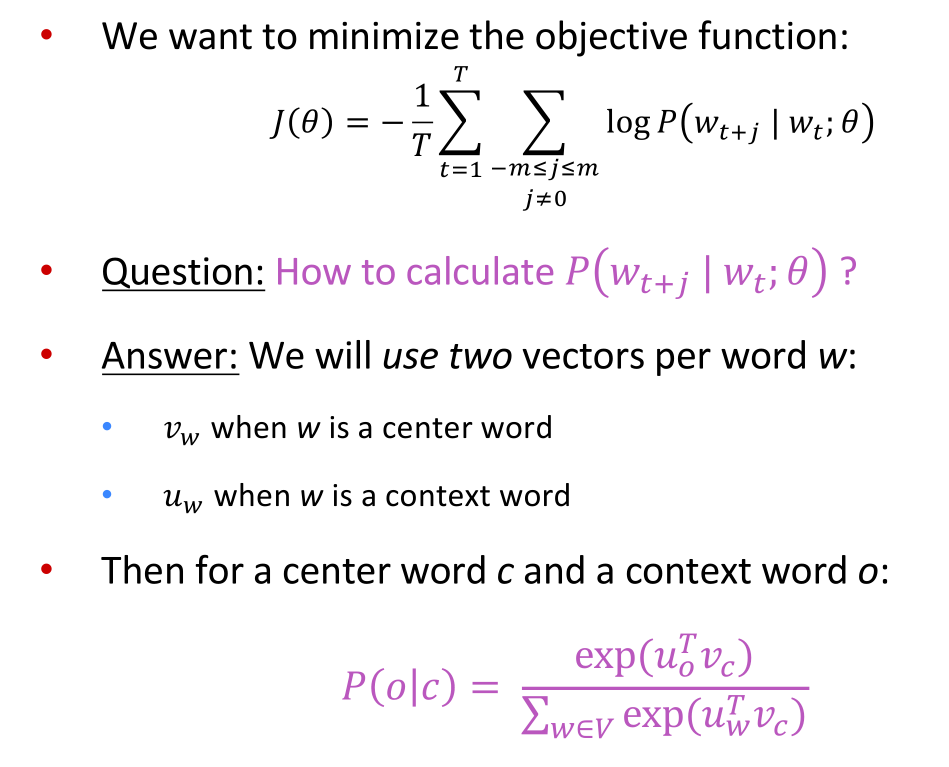

> every word has two vectors, center and context

For example:
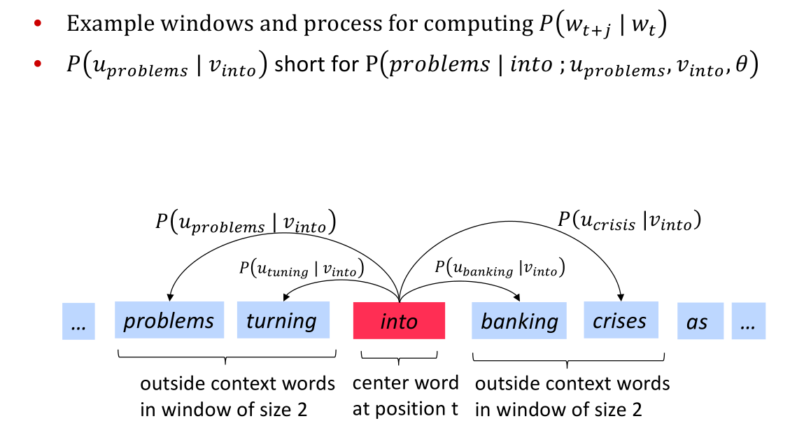

The dot product in vector space as our similarity measure between words and then use a softmax distribution to map any number into a probability distribution:
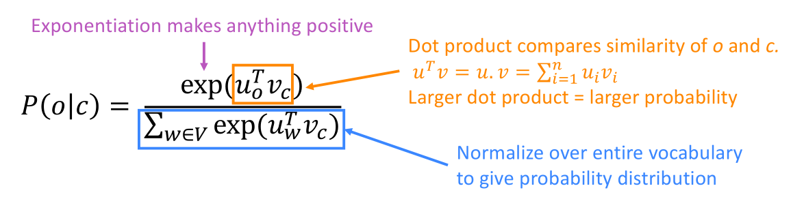
- dot product calculates the similarity of vectors
- exponential makes sure to keep everything positive, i.e. probability is positive
- sum over every possible word in our vocabulary for normalization, i.e. probability adds to one

The softmax distribution put probability mass where the max is and it's soft because it spreads less probability everywhere else:
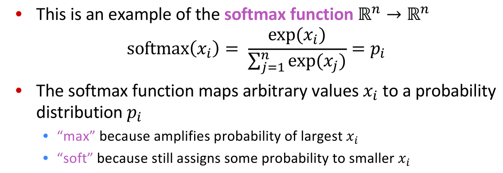

The only parameters that this model has is literally the vector space representations of words:
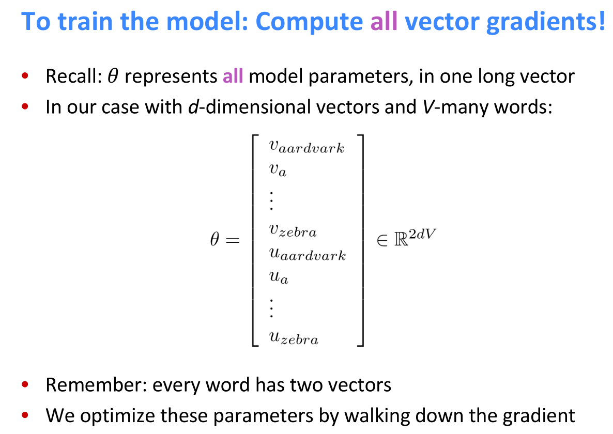

We start with two random vectors for each word (center and context) then we iteratively change those vectors a little as we learn by optimization.

The word vectors would calculate a higher probability for the words that actually occur in contexts of this center word. We do this many times until eventually we end up with good word vectors.

### Optimization basics
So, we had this formula that we wanted to maximize, our original function:
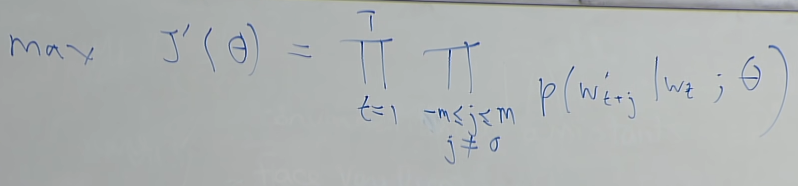

Log-Likelihood conversion for minimization:
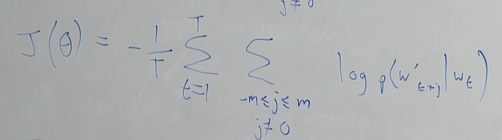

Probability of the outside / context word given the context word:
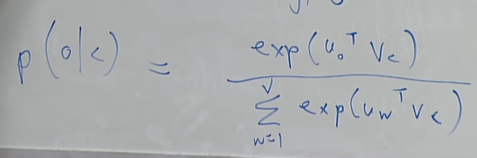

We want to minimize \(J(\theta)\) by changing these parameters \(\theta\). We're gonna take derivatives and work out what direction downhill is and then we wanna walk that way:
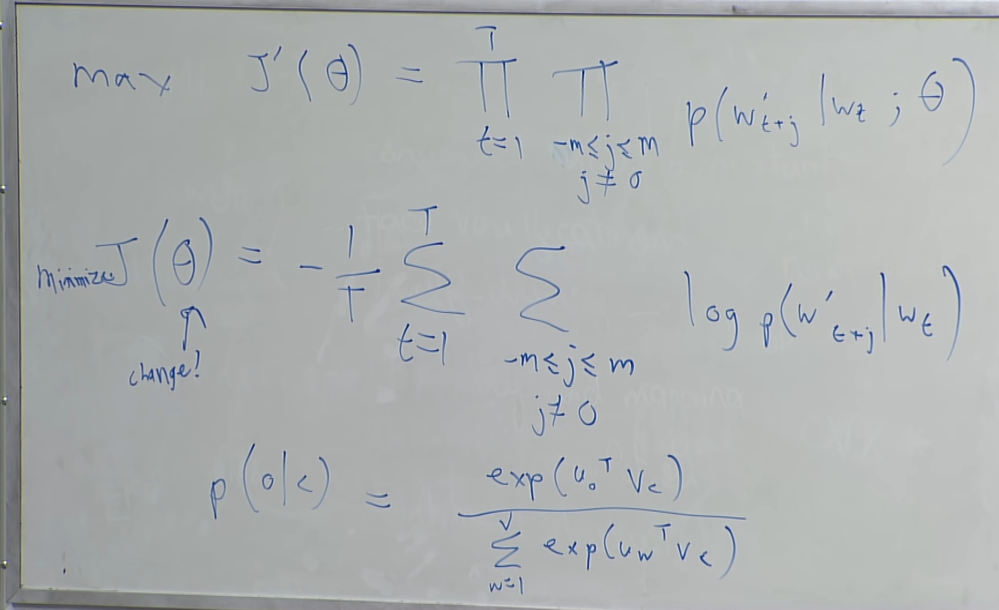

I have a meaningful word vector. And that vector knows what words occur in the context of itself. And knowing what words occur in its context means, it can accurately give a high probability estimate to those words that occur in the context, and it will give low probability estimates to words that don't typically occur in the context.

> we're using a simple probability distribution to predict all words in our context given the center word

The parameters \(\theta\) are our word vectors. For example, the parameters of the center word \(v_c\) must be changed as the partial derivative of the softmax with respect to this center word:
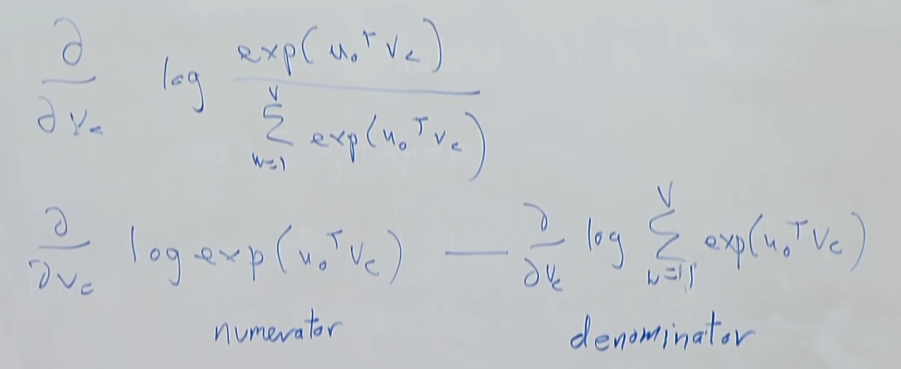
- numerator: logaritm and exponential cancel

Example for one component \(v_{c1}\):
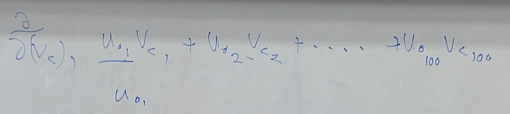
- e.g. partial derivative with respect to \(v_{c1}\) is just \(u_{01}\)

For all components of the \(v_c\) vector:
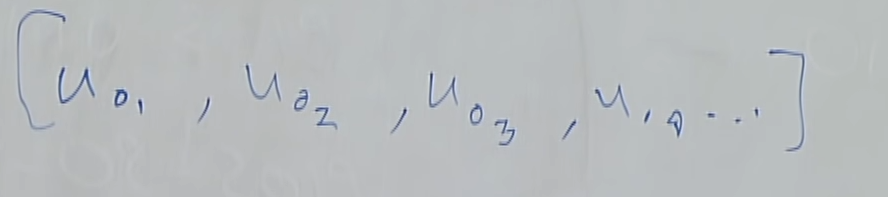

So the end result for the numerator is the vector \(u_0\)
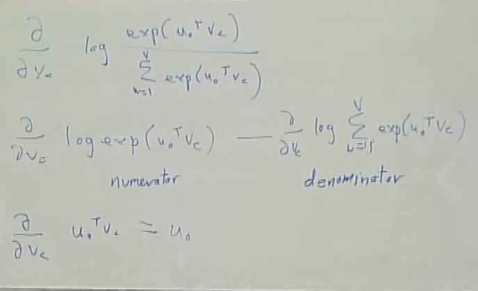

We need the chain rule for the denominator:
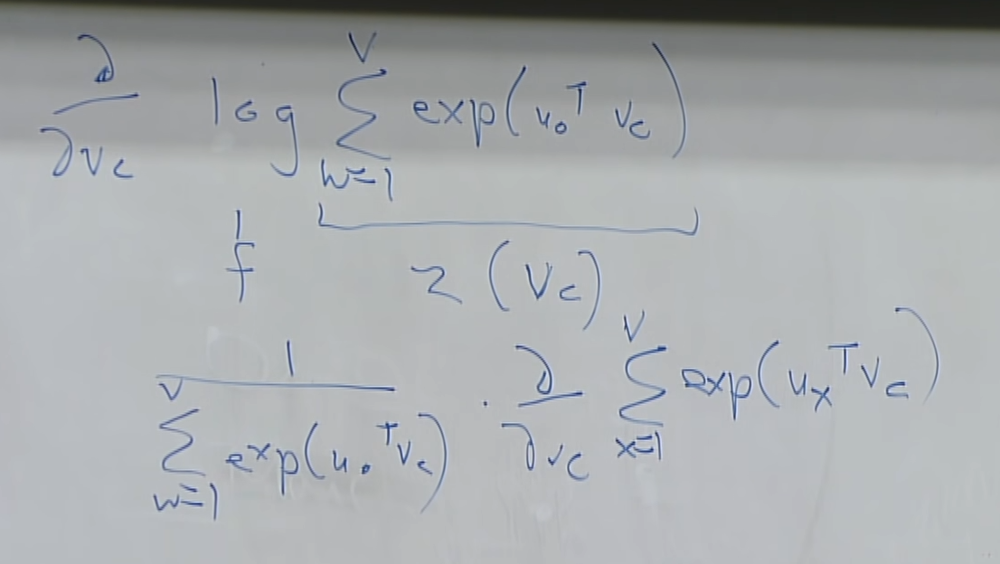
- chain rule: first take the derivative of the outside \(f\) and evaluate, and then we remember that the derivative of log is one on X.
- Then, we multiply with the derivative of the inside part \(z(vc)\)

We swap the partial derivative and the sum and apply the chain rule again:
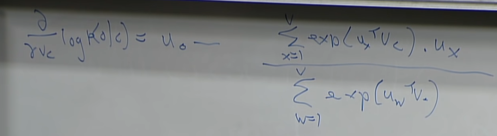

re-arrange the numerator, e.g. taking the sum and the \(u_x\):
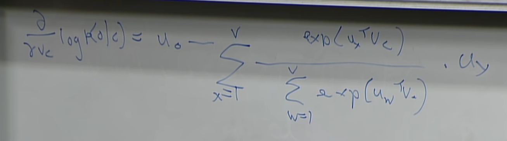

We've rediscovered exactly the same form that we use as our probability distribution for predicting the probability of words:
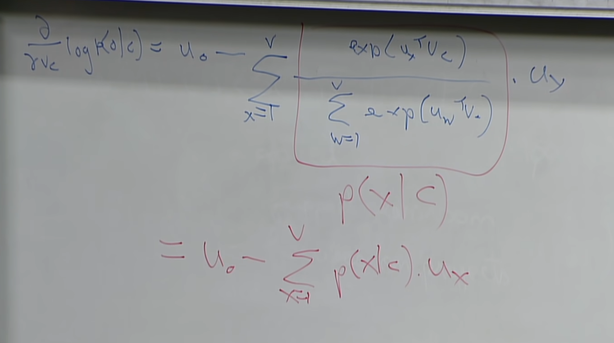

This is actually giving us our slope in this multi-dimensional space:
- \(u_0\):observed representation of the context word
- we're subtracting from that what our model thinks what the context should look like as an expectation

So, what you're doing is you're finding the weighted average of the models representations of each word \(u_x\), multiplied by the probability of it in the current model \(p(x \vert c)\). So, this is sort of the expected context word according to our current model.

So we're taking the difference between the expected context word and the actual context word that showed up, and that difference then turns out to exactly give us the slope as to which direction we should be walking changing the words representation in order to improve our model's ability to predict.

## Looking at word vectors
`gensim word vector visualization`

Gensim doesn't natively support GloVe vectors but they actually provide a utility that converts the GloVe file format to the word2vec file format. And then we can load a pre-trained model of word vectors.

> sort of a big dictionary with a vector for each word.

Understanding the relationships between words:
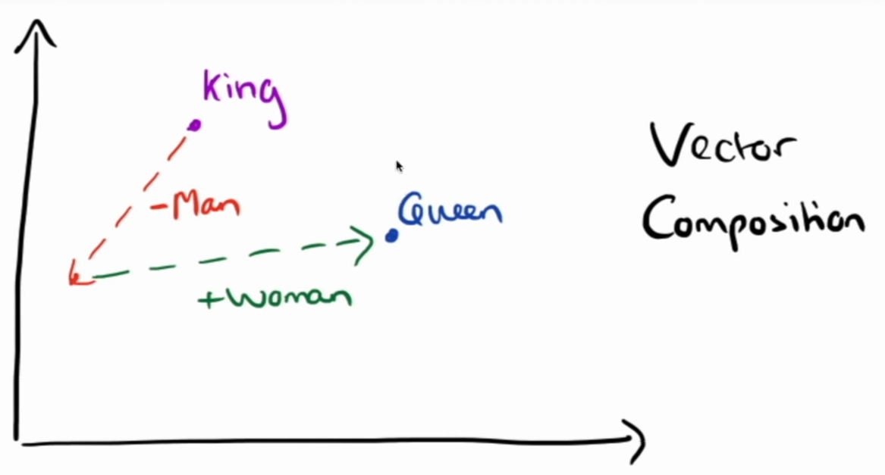

> directions in the space that you can point which have a certain meaning.

# Notes
## How to represent words?
To perform well on most NLP tasks we first need to have some notion of similarity and difference between words. With word vectors, we can quite easily encode this ability in the vectors themselves (using distance measures such as Jaccard, Cosine, Eu- clidean, etc).

*Denotational semantics:* The concept of representing an idea as a symbol (a word or a one-hot vector). It is sparse and cannot capture similarity. This is a "localist" representation.
*Distributional semantics:* The concept of representing the meaning of a word based on the context in which it usually appears. It is dense and can better capture similarity.

## Word Vectors
We want to encode word tokens each into some vector that represents a point in some sort of "word" space. Each dimension would encode some meaning that we transfer using speech.

One-hot vector:
    - Represent every word as a vector with all 0s and one 1 at the index of that word.
    - We represent each word as a completely independent entity. As we previously discussed, this word representation does not give us directly any notion of similarity

> So maybe we can try to reduce the size of this space to something smaller and thus find a subspace that encodes the relationships between words.

### Singular Value Decomposition (SVD) Based Methods
For this class of methods to find word embeddings (otherwise known as word vectors), we first loop over a massive dataset and accumu- late word co-occurrence counts in some form of a matrix X, and then perform Singular Value Decomposition on X to get a descompisiton. We then use the rows of U as the word embeddings for all words in our dictionary.

### Word-Document Matrix
As our first attempt, we make the bold conjecture that words that are related will often appear in the same documents. For instance, "banks", "bonds", "stocks", "money", etc. are probably likely to ap- pear together. But "banks", "octopus", "banana", and "hockey" would probably not consistently appear together.

We use this fact to build a word-document matrix \(X\) in the following manner: Loop over billions of documents and for each time word \(i\) appears in document \(j\), we add one to entry \(X_{ij}\).

> This is obviously a very large matrix: Vocab x M documents

### Window based Co-occurrence Matrix
The same kind of logic applies here however, the matrix \(X\) stores co-occurrences of words thereby becoming an affinity matrix. In this method we count the number of times each word appears inside a window of a particular size around the word of interest. We calculate this count for all the words in corpus.

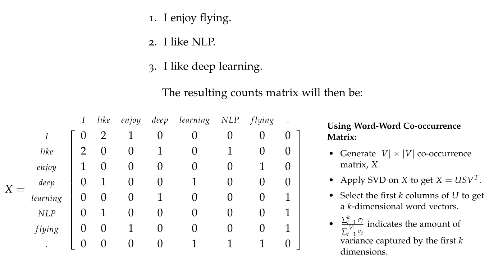

### Applying SVD to the cooccurrence matrix
We now perform SVD on X, observe the singular values (the diago- nal entries in the resulting S matrix), and cut them off at some index k based on the desired percentage variance captured:
\[
    \frac{\sum^k_{i=1} \sigma_i}{\sum^{\vert V \vert}_{i=1} \sigma_i}
\]

We then take the submatrix of U, \(\vert V \vert\) x \(k\). To be our word embedding matrix. This would thus give us a k-dimensional representation of every word in the vocabulary.
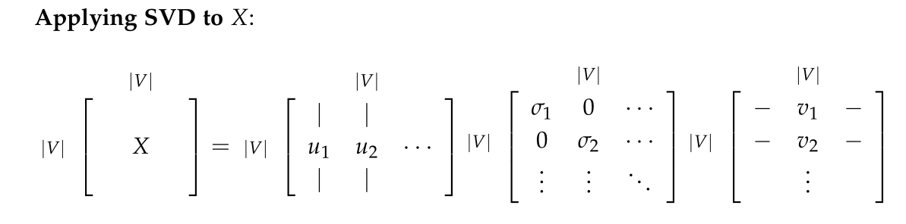
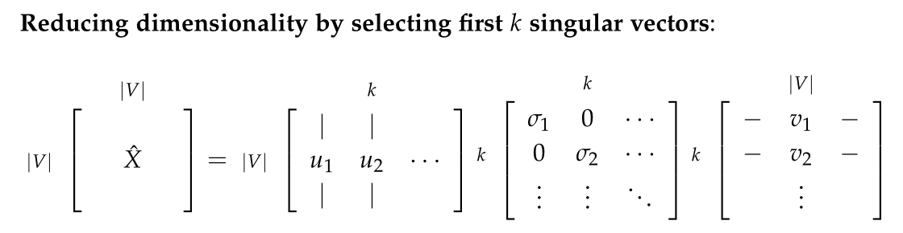

Both of these methods give us word vectors that are more than sufficient to encode semantic and syntactic (part of speech) information but are associated with many other problems:
- The dimensions of the matrix change very often (new words are added very frequently and corpus changes in size).
- The matrix is extremely sparse since most words do not co-occur.
- The matrix is very high dimensional in general
- Quadratic cost to train (i.e. to perform SVD)
- Requires the incorporation of some hacks on X to account for the drastic imbalance in word frequency

> SVD based methods do not scale well for big matrices and it is hard to incorporate new words or documents. Computational cost for a m × n matrix is \(O(mn^2)\)

## Iteration Based Methods - Word2vec
*Iteration-based methods capture cooc- currence of words one at a time instead of capturing all cooccurrence counts directly like in SVD methods.*

Let us step back and try a new approach. Instead of computing and storing global information about some huge dataset (which might be billions of sentences), we can try to create a model that will be able to learn one iteration at a time and eventually be able to **encode the probability of a word given its context.**

The idea is to design a model whose **parameters are the word vectors**. Then, train the model on a certain objective. At every iteration we run our model, evaluate the errors, and follow an update rule that has some notion of penalizing the model parameters that caused the error. Thus, **we learn our word vectors.**

> This model relies on a very important hypothesis in linguistics, distributional similarity, the idea that similar words have similar context.

Word2vec is a software package that actually includes:
- 2 algorithms:
    - continuous bag-of-words (CBOW): aims to predict a center word from the surrounding context in terms of word vectors
    - skip-gram: predicts the distribution (probability) of context words from a center word.
- 2 training methods:
    - negative sampling: defines an objective by sampling negative examples
    - hierarchical softmax: defines an objective using an efficient tree structure to compute probabilities for all the vocabulary

> The context of a word is the set of m surrounding words

### Language Models (Unigrams, Bigrams, etc.)
We need to create such a model that will assign a probability to a sequence of tokens. A good language model will give a sentence a high probability when is a completely valid sentence, syntactically and semantically.

We can take the unary language model approach and break apart this probability by assuming the word occurrences are completely independent, i.e. *Unigram model*
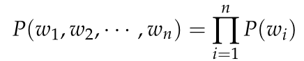

We know the next word is highly contingent upon the previous sequence of words, we let the probability of the sequence depend on the pairwise probability of a word in the sequence and the word next to it. We call this the *bigram* model and represent it as:
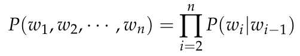

> This would require computing and storing global information about a massive dataset.

Now that we understand how we can think about a sequence of tokens having a probability, let us observe some example models that could learn these probabilities.

### Continuous Bag of Words Model (CBOW)
*Predicting a center word from the surrounding context.*

From the context, be able to predict or generate the center word. Example: "The cat jumped over the puddle."
- center word: jumped
    - output as one hot vector \(y\)
- context:  {"The", "cat", ’over", "the’, "puddle"}
    - input as one hot vectors \(x^c\)

For each word, we want to learn 2 vectors:
- v: (input vector) when the word is in the context
- u: (output vector) when the word is in the center
- n: size of our embedding space

Notation for CBOW Model:
- \(w_i\): word \(i\) from vocabulary \(V\)
- \(\mathbb{V} \in \mathbb{R^{n \times \vert V \vert}}\): input word matrix
    - embeddings x vocab_size
- \(v_i\): \(i\)-th column of \(\mathbb{V}\), the input vector representation of word \(w_i\)
    - the embedding of the word
- \(U \in \mathbb{R^{\vert V \vert \times n}}\): output word matrix
- \(u_i\): i-th row of \(U\), the output vector representation of word \(w_i\)

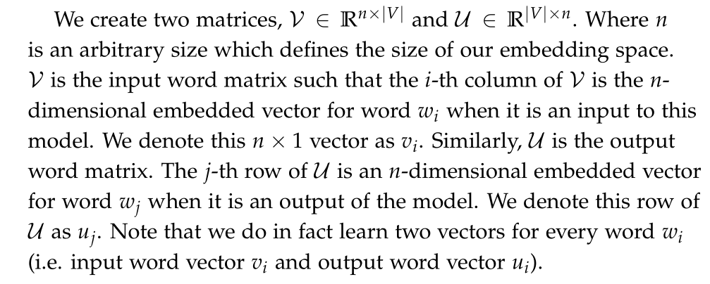

Note that we do in fact learn two vectors for every word \(w_i\) (i.e. input word vector \(v_i\) and output word vector \(u_i\)).

> input: context, output: center

To learn the vectors (the matrices U and V) CBOW defines a cost that measures how good it is at predicting the center word. Then, we optimize this cost by updating the matrices U and V thanks to stochastic gradient descent.

### Skip-Gram Model
*Given the center word, the model will be able to predict the surrounding words*

Naive Bayes assumption to break out the probabilities, i.e. independence assumption. In other words, given the center word, all output words are completely independent.

Only one probability vector \(\hat{y}\) is computed. Skip-gram treats each context word equally: the models computes the probability for each word of appearing in the context independently of its distance to the center word.

### Negative Sampling
Loss functions J for CBOW and Skip-Gram are expensive to compute because of the softmax normalization, where we sum over all \(\vert V \vert\) scores.

For every training step, instead of looping over the entire vocabulary, we can just sample several negative examples.

### Hierarchical Softmax
Mikolov et al. also present hierarchical softmax as a much more efficient alternative to the normal softmax. In practice, hierarchical softmax tends to be better for infrequent words, while negative sam- pling works better for frequent words and lower dimensional vectors.

Hierarchical softmax uses a binary tree to represent all words in the vocabulary. Each leaf of the tree is a word, and there is a unique path from root to leaf. In this model, there is no output representation for words. Instead, each node of the graph (except the root and the leaves) is associated to a vector that the model is going to learn.
