# Word Vectors and Word Senses
## word2vec
*maximizes objective function by putting similar words nearby in space*

Iterative updating algorithm that learns vector representations of words by moving to each word, treat it the center word and predict its surrounding words by having a probability distribution over words that will occur around that defined as the dot-product of the center and context word vectors via the Softmax function:
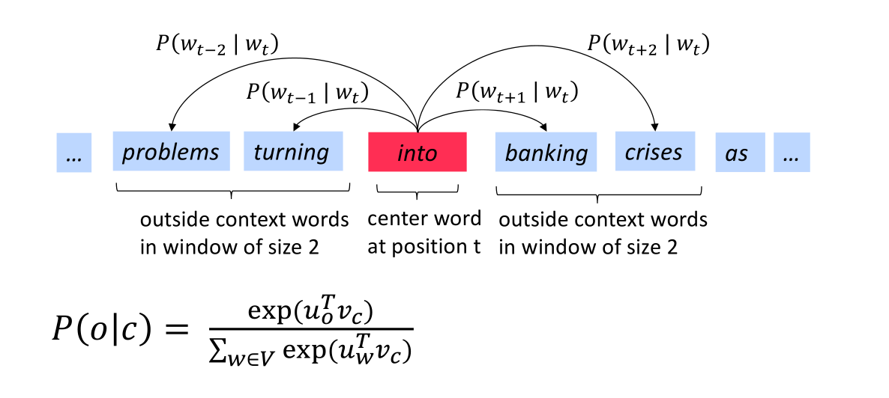
1. iterate through each word of the whole corpus
1. predict surrounding words using word vectors

> we want to change those vectors so we can have high probability for words in context.

We have to two matrices, one for center and context/outside words where the word vectors are represented as rows:
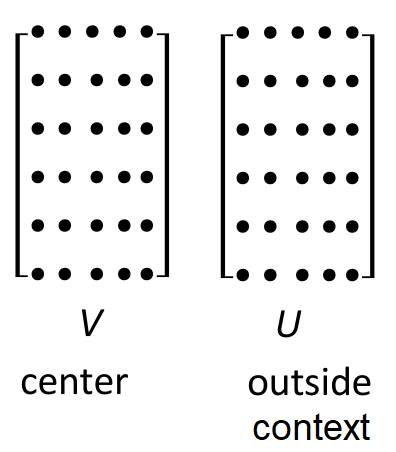

For a particular center word \(4\) represented as \(v_4\):
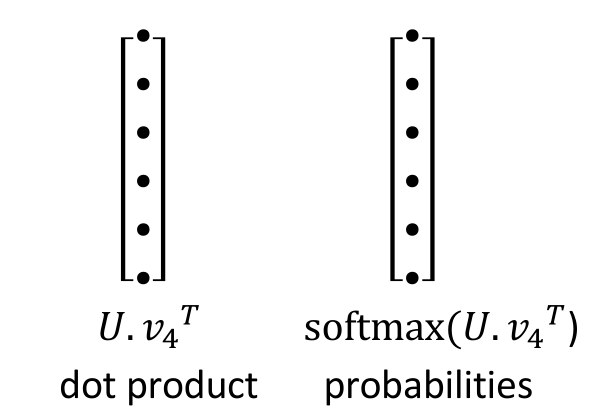
- dot-product: scores
- softmax: probability distribution of words that are likely to occur in context

We're using only one probability distribution, so the predicted words have the same probability distribution in the given context, i.e. order in the sentence doesn't matter, only that occurs anywhere in the given context. The model gives high probability to all words that occur in context fairly often (we remove high frequency words e.g. the).

> same predictions at each position, i.e. we only care about context likelihood

## Optimization basics
### Gradient Descent
To minimize the cost function \(J(\theta)\), calculate the gradient of the cost function with respect our word vectors weights \(\theta\):
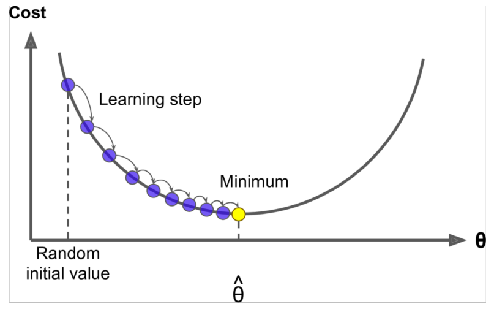

Small step in the direction of negative gradient, *update equation*:
\[
    \theta^\text{new} = \theta - \alpha \nabla_\theta J(\theta)
\]
- \(\alpha\): learning rate / step size

> use Stochastic gradient descent (SGD) to repeatedly sample windows as a mini-batch and update rather than using the entire corpus at once

**Stochastic gradients with word vectors**
Each mini-batch of windows only contains a handful of words, so the gradient \(\nabla_\theta J_t(\theta)\) is very sparse:
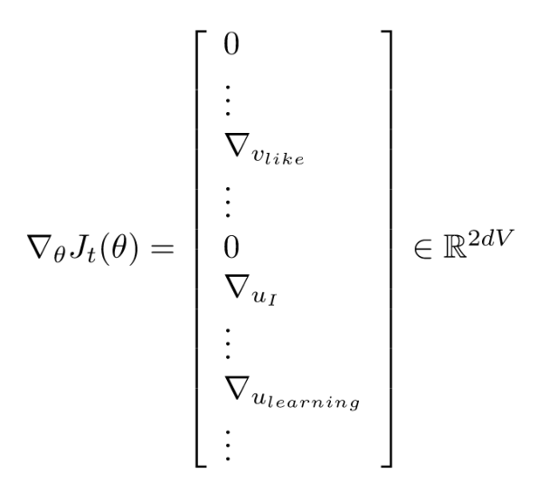

We want to only update word vectors that appear. Solution:
- either you need sparse matrix update operations to only update certain rows of full embedding matrices U and V
- or, you need to keep around a hash for word vectors

## Word2Vec
We use two vectors for the same word (center and context/outside) for easier optimization and at the end we just average them but we can do it with just one vector per word.

Model variants:
- *Skip-gram (SG)*: predict all context/outside words (position independent) at once given the center word
- *Continuous Bag of Words (CBOW)*: predict the center word from/given (a bag of) context words considered independently (e.g. naïve Bayes)

Training variants:
- *Naïve softmax*: probability estimates for the context words by summing over the whole vocabulary
    \[
        P(o \vert c) = \frac{\exp(u_o^t v_c)}{\sum_{w \in V} \exp(u^T_w v_c)}
    \]    
    - simpler but expensive / slow training method because the normalization factor is computationally expensive
- *Negative sampling*: train binary logistic regressor for pair of words (center and its context window) of
    - high probability center and observed/true context words
    - low probability center and *negative samples*, i.e. not seen words of random samples

The Sigmoid function is a binary case of the Softmax function:
\[
    \sigma(x) = \frac{1}{1 + e^{-x}}
\]

The overall objective to maximize:
\[
    J(\theta) = \frac{1}{T} \sum^T_{t=1} J_t(\theta) \\
    J_t(\theta) = \log \sigma(u^T_o v_c) + \sum_{i=1}^k \mathbb{E}_{j \sim P(w)} \big[ \log \sigma(-u^T_j v_c) \big]
\]
- maximize the probability of true pairs of context \(c\) and outside \(o\) words
- minimize the probability of negative/noisy pairs of context \(c\) and sampled \(j \sim P(w)\) of \(k\) outside words, using word probabilities \(P(w)\).

The same objective but for minimization and class notation is:
\[
    J(\theta) = \frac{1}{T} \sum^T_{t=1} J_{\text{neg_sample}}(o, v_c, U) \\
    J_{\text{neg_sample}}(o, v_c, U) = - \log( \sigma(u^T_o v_c) ) - \sum_{k=1}^K \log(\sigma(-u^T_k v_c))
\]
- maximize probability that real outside word appears
- minimize the probability that \(k\) negative samples words appear around center word, i.e. take \(k\) using probabilities \(P(w)\)
    - making a dot-product and negating it

**Word probability**
Sampling distribution to deal with high frequent words:
\[
    P(w) = \frac{U(w)^{\frac{3}{4}}}{Z}
\]
- \(U(w)\): unigram distribution, i.e. count words / frequency in the corpus
- \(Z\): normalization to obtain a probability distribution
    - summing the obtained numerator to divide and normalize

> power/exponent make less frequent/rare words be sampled more often and decrease how often we sample common words

## Latent Semantic Analysis (LSA)
*models are less robust if only using counts*

Using a co-occurrence counts directly
- size increases with vocabulary / sparsity issues
    - very high dimensional: requires a lot of storage
- symmetric (irrelevant whether left or right context)

Use Singular Value Decomposition (SVD) for dimensionality reduction to store most of the important information in a fixed, small number of dimensions in a dense vector, i.e. keep only top singular values in order to generalize.

**Count based vs. direct prediction**
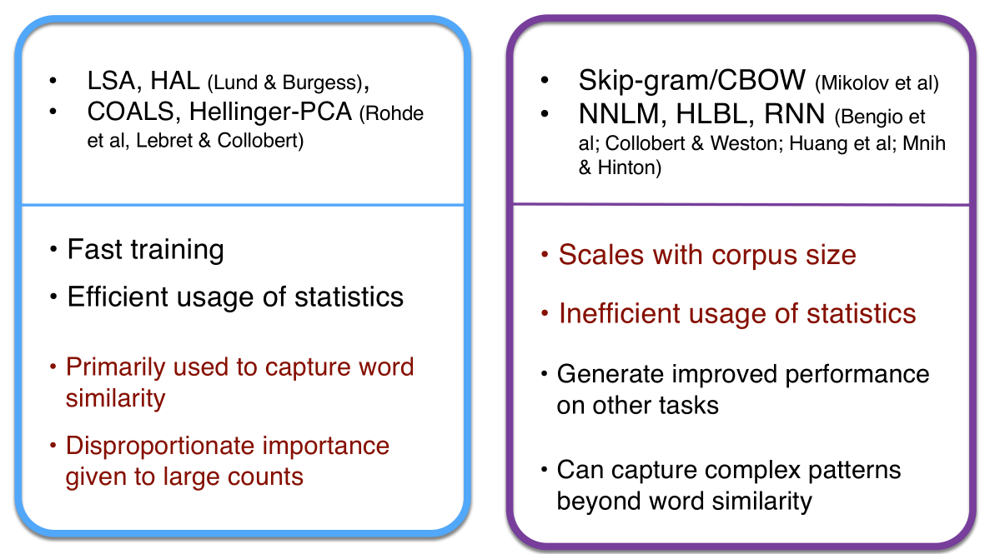

> Scale word counts rather than using raw help a lot

## The GloVe model of word vectors
Ratios of co-occurrence probabilities can encode meaningful linear components in a word vector space:
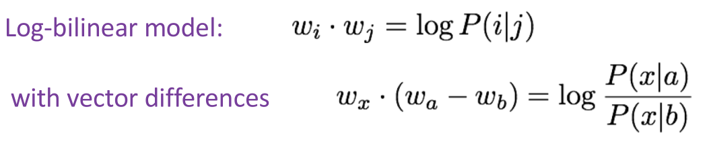
. make the dot-products equal to the log of the co-occurrence probability
- then immediately, the vector difference turns into the ratio of the co-occurrence probabilities

The objective is:
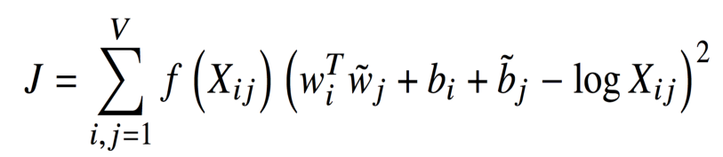
- dot-product as log of co-occurrence probabilities: \(w^T_i \tilde{w}_ j - \log X_{ij}\)
- add bias terms for both words: \(b_i\) and \(\tilde{b}_j\)

Limit common word pairs:
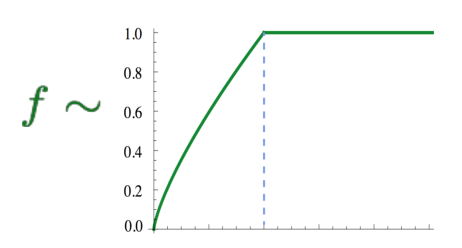

Glove Results:
- Fast training
- Scalable to huge corpora
- Good performance even with small corpus and small vectors

## Evaluating word vectors
- intrinsic: evaluate on a subtask to understand the system
    - fast to compute
    - but not clear if helpful, unless some previous correlation to a real task was established
- extrinsic: evaluate on a real task
    - long time to compute
    - unclear if the subsystem is the problem or its interaction or other subsystems

### Analogy evaluation and hyperparameters
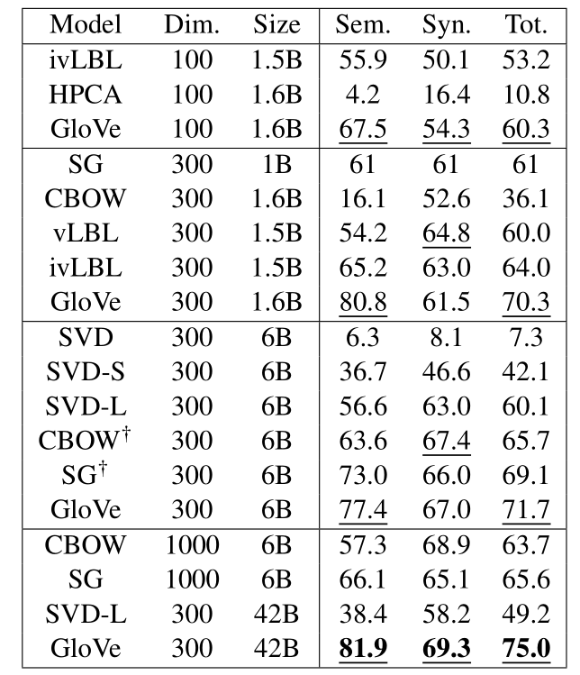
- doing manipulations of the count matrix before you do an SVD helps, e.g. SVD-L
- bigger dimensionality works better up to a point
- the amount of text makes a difference

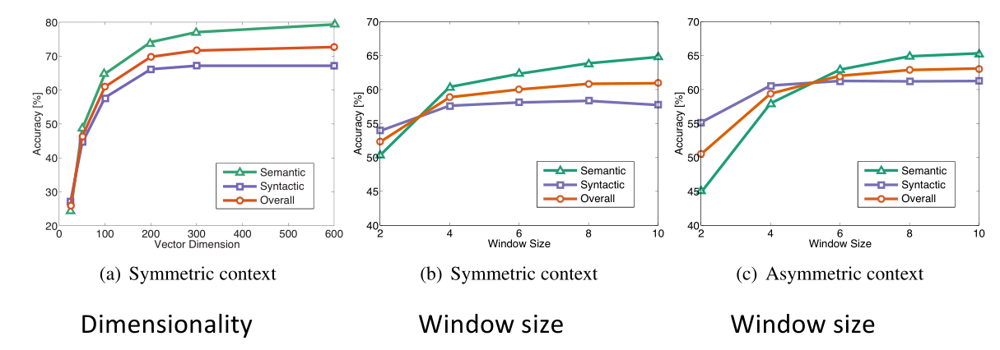
- good dimension around 300
- Asymmetric context (only words to the left) are not as good but depends on the task
- Window size of 8 around each center word is good

More training time helps:
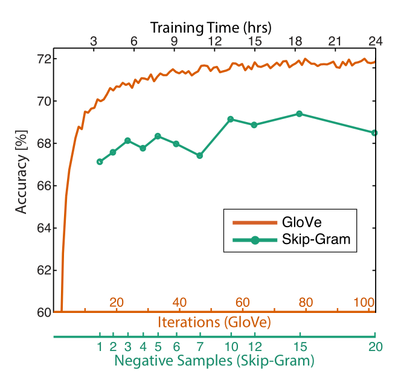

More data helps:
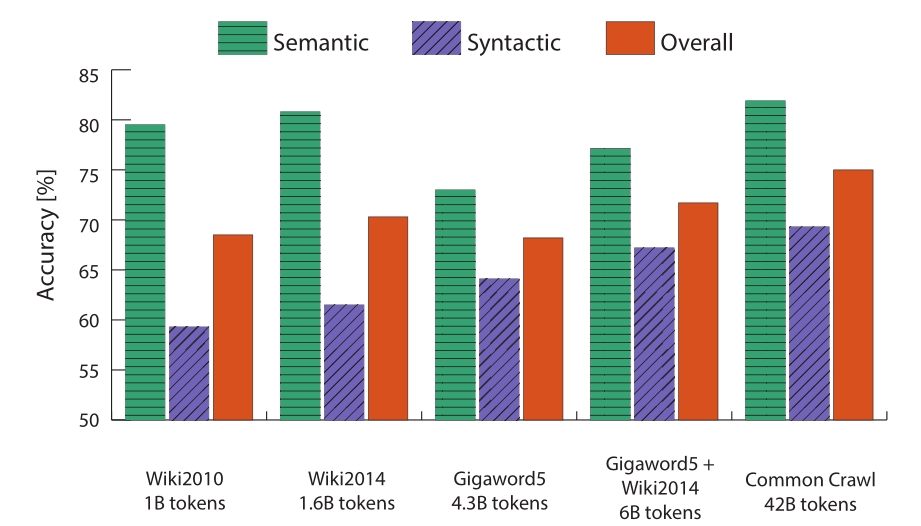
- Wikipedia is better because they explain/connect meanings

### Word senses and word sense ambiguity
Most words have lots of meanings, especially common words and words that have existed for a long time. Different senses of a word reside in a linear superposition (weighted sum) in standard word embeddings like word2vec:
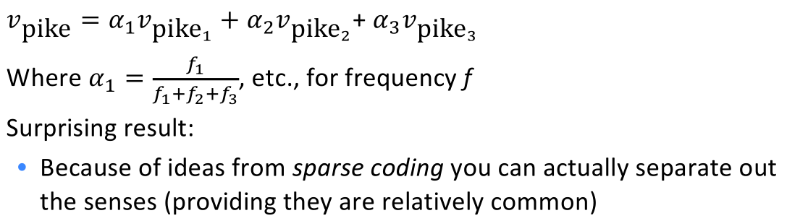
