# Neural Networks
## Classification
Training dataset of samples:
\[
    \{ x_i, y_i \}^N_{i=1}
\]
- \(x_i\): inputs words or vectors of dimension \(d\)
- \(y_i\): other words or labels in one of \(C\) classes

Simple illustration case:
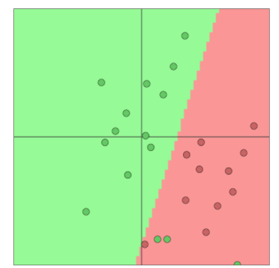
- Fixed 2D word vectors to classify
    - training dataset
- Using softmax/logistic regression
    - train regression weights \(w \in \mathbb{R}^{C \times d}\)
- Linear decision boundary
    - hyperplane

### Prediction
For each input datapoint \(x\):
\[
    p(y \ert x) = \frac{\exp (w_y x)}{\sum_{c=1}^C \exp(w_c x)}
\]
- select the \(y^text{th}\) row of \(w\) which corresponds to weight vector for each class:
    \[
        w_y x = \sum_{i=1}^d w_{y_i} x_i = f_y
    \]
    - \(f_y\): score of how likely that input example belongs to a class
- apply the \(\text{Softmax}(f_y)\)  function to get a normalized probability:
    \[
        p(y \ert x) = \frac{\exp (f_y)}{\sum_{c=1}^C \exp(f_c)}
    \]
    - \(f_c\) for \(c = 1, \ldots, C\)

### Training with softmax and cross-entropy loss
For each training example \((x, y)\) our objective is to maximize the probability of the correct class \(y\), i.e. minimize the negative log-likelihood (NLL loss):
\[
    - \log p(y \vert x) = - \log \bigg( \frac{\exp(f_y)}{\sum_{c=1}^C \exp(f_c)} \bigg)
\]
- highest probability to the correct class
- low probability to other classes

**Cross entropy loss/error**
The cross-entropy is the negative sum of all possible classes of true weighted by log-prediction of a class:
\[
    H(p, q) = - \sum_{c=1}^C p(c) \log q(c)
\]
- assume a true underlying probability distribution \(p\)
    - what's the probability of the class according to the true model as a weight
- let our computed model probability be \(q\), e.g. Softmax
    - probability according to our estimated model

In classification we have a label/target/ground truth so the probability distribution for that is one and zero everywhere else (*one-hot encoding*), i.e. the only term left is the negative log-probability of the true class.

### Traditional ML optimization
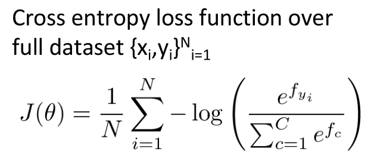
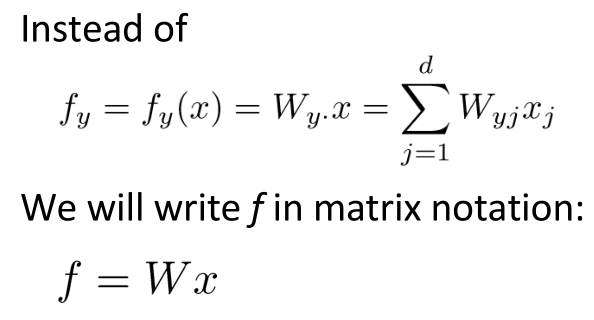

In machine learning:
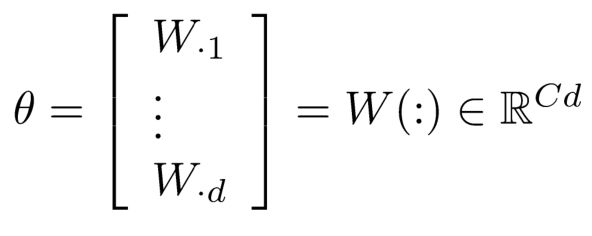
- for each of the column classes \(c\) we have a \(d\)-dimensional row vector \(\theta\) of weights
- size: \(c\) classes times \(d\) dimension of each

So we only update the decision boundary via:
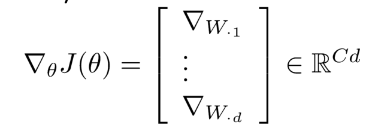

> softmax (logistic regression) gives only linear decision boundaries (high bias)

### Classification with word vectors
We're simultaneously changing the weights \(w\) of the model and the input representation of words \(x\), and we're optimizing both of them at once to allow our classifier to do better:
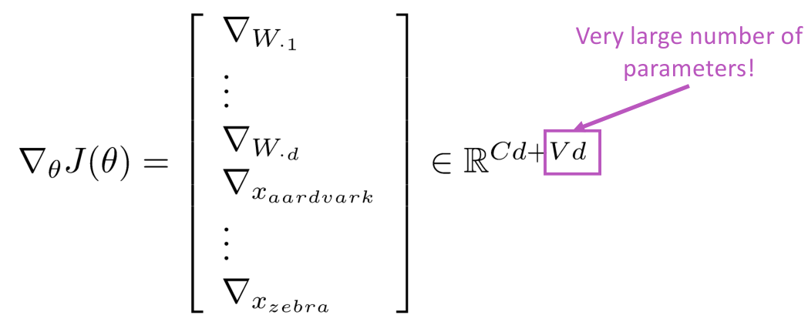
- learn both model parameters \(W\) and word vector representations embeddings \(x\)
- \(W\) size: \(C\) classes times \(d\) vector dimension
- word embeddings size: vocabulary \(V\) times \(d\) vector dimension

The word vectors represent one-hot vectors that we move around in an intermediate layer vector space (embeddings) for easy classification with a (linear) softmax classifier.

> word vector embedding is just one more neural network layer, where the inputs are one-hot encoded, i.e. selection.

## Neural Network Classifiers
Learn much more complex functions and nonlinear decision boundaries:
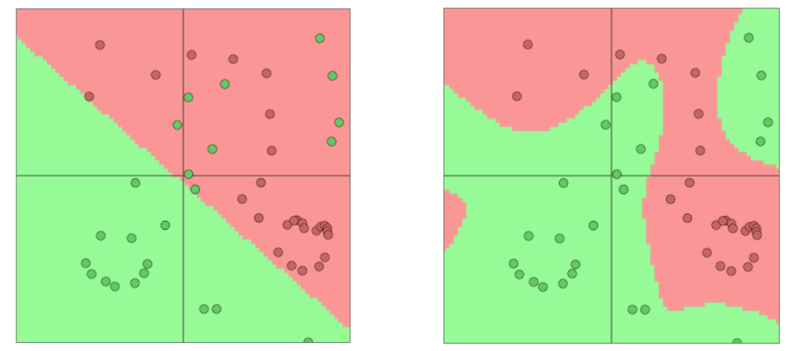

### Artificial neuron
*perceptron*

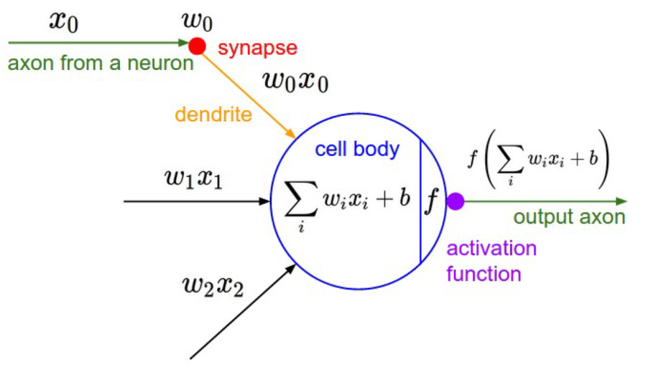
- \(x_0, x_1, x_2\) are axons coming from other neurons
- synapse vary the amount the signal that passes, i.e. input are modulated by a weight \(w\)
- the cell body combines the amount of excitation coming from different dendrites
    - \(w\): weights
    - \(b\): bias term
- threshold as activation function \(f\)
    - non linear activation function, e.g. sigmoid
- we generate a new axon as an output signal

A neuron can be a binary logistic regression unit, a *hidden unit* therefore:
\[
    h_{w, b}(x) = f(w^T x + b)
\]
- \(x\): inputs
- \(w\): weights
- \(b\): bias, *always on input/feature* as a class prior modulated by a bias term
- \(f\): non-linear activation function

> without non-linearities (bending), deep neural networks can’t do anything more than a linear transform because a sequence of linearities is a single/composed linear transform

### A neural network
*running several logistic regressions at the same time, everything is connected*

We feed a vector of inputs through a bunch of logistic regression functions, then we get a vector of output:
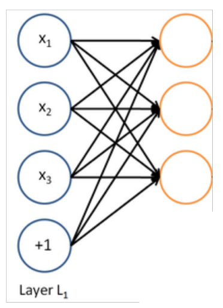

We want the neural network to self-organize, so that those orange logistic regression output units learn something useful for the given task.

> we don’t have to decide ahead of time what these logistic regressions are trying to predict

We can feed into another logistic regression layer:
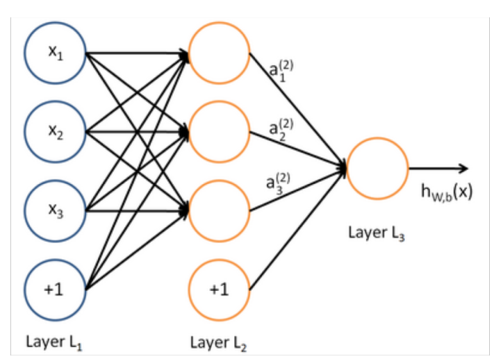
- inputs are previous intermediate layer of logistic regression units
- train the full network to minimize our cross entropy loss

The final classifier, its just a linear classifier, a soft-max or logistic regression. The intermediate classifiers act like a word embeddings, they can re-represent the space and shift things around, i.e. learning a highly non-linear function of the original input space.

> this loss function directs the intermediate hidden variables should be, i.e. help the final linear softmax classifier make a good decision

**Matrix notation for a layer**
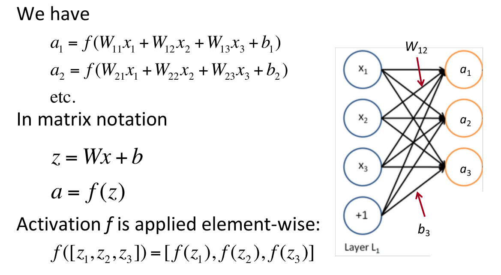

### Deep Learning
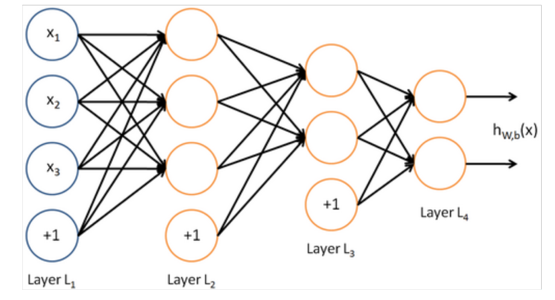
- in the 50s: model of single neuron
- in the 80's-90's: single hidden layer
- current: deeper networks

> With more layers, they can approximate more complex functions

## Named Entity Recognition (NER)
*Find and classify names in text*

Predict entities by classifying words in context and then extracting entities as word subsequences:
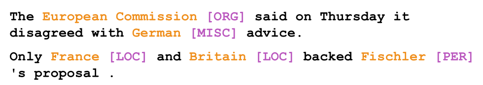
- hard to work out boundaries of entity
- hard to know if something is an entity
- hard to know class of unknown/novel entity
- entity class is ambiguous and depends on context

### Window classification
*classify a word in its context window of neighboring words.*

Train softmax classifier to classify a center word by taking concatenation of word vectors surrounding it in a window. Example, classify “Paris” in the context of this sentence with window length 2:
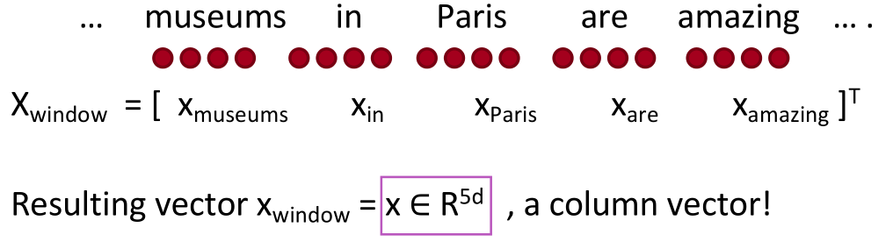

> average the word vectors in a window and to classify the average vector would lose position information.

## Binary classification with unnormalized scores
*true vs. corrupted word window classification*
Extra hidden layer can calculate non-linear interactions between the input word vectors. Compute a window’s score with a 3-layer neural net:
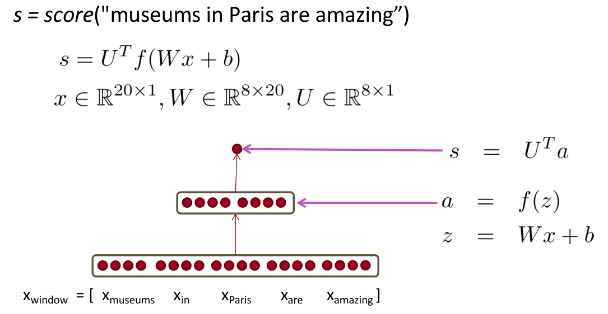
- use neural activation \(a\) simply to give an unnormalized score
- true window with Paris in its center and all other windows are “corrupt” in terms of not having a named entity location in their center.

**margin loss**
True window’s score larger and corrupt window’s score lower:
\[
    J = \max(0, 1 - s + s_c)
\]
- sample several corrupt windows per true one
- sum over all training windows

Each window with an NER location at its center should have a score +1 higher than any window without a location at its center
