# Backpropagation
## Updating word gradients in window model
Push word vectors around so that they will (in principle) be more helpful:
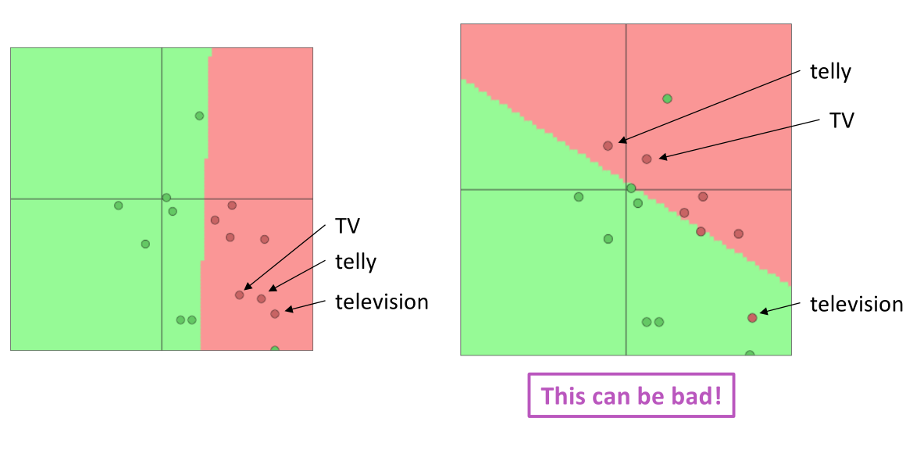
- words that are in the training data move around, e.g. TV and telly
- words not in the training data stay where they were, e.g. television

> if you only have a small training data set, don’t train / fine-tune / update the word vectors

## Computation graphs and backpropagation
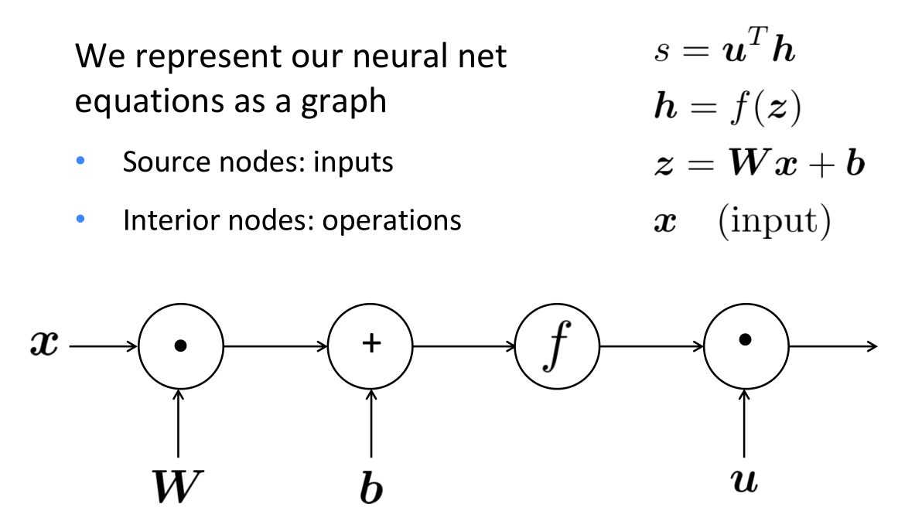

**Backpropagation:**
 - recursively apply the chain rule along computation graph
 - [downstream gradient] = [upstream gradient] x [local gradient]
 - Forward pass: compute results of operations and save intermediate values
 - Backward pass: apply chain rule to compute gradients

### Forward Propagation
*expression evaluation*

Edges pass along result of the operation:
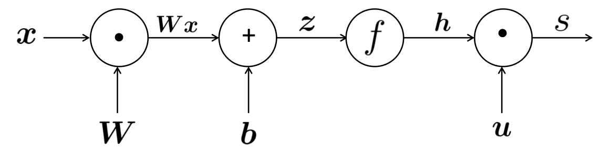

### Backpropagation
*pass along gradients*

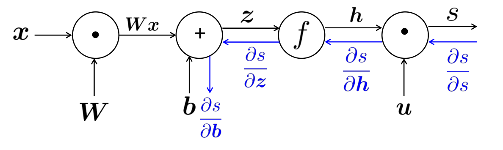
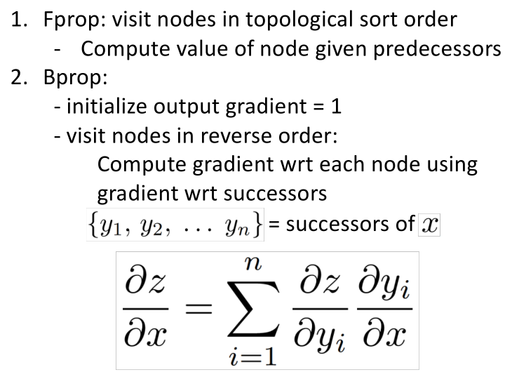

> compute all gradients at once

**Single node**
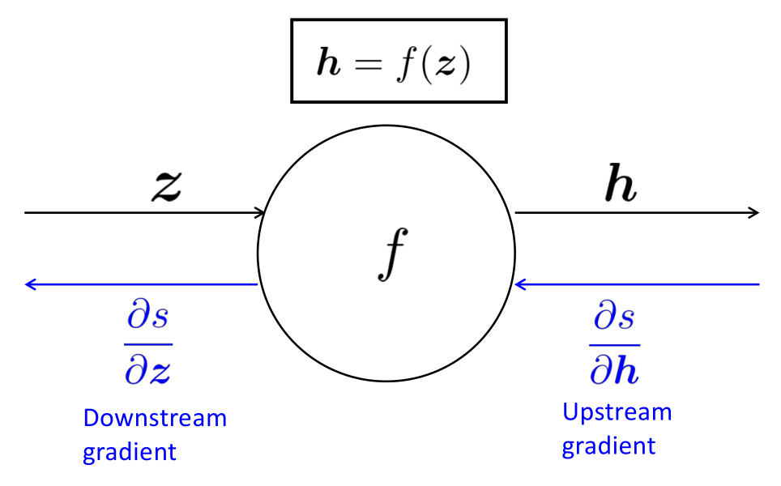
- node receives an *upstream gradient*
- pass on the correct *downstream gradient*

Each node has a local gradient as the gradient of it’s output with respect to it’s input:
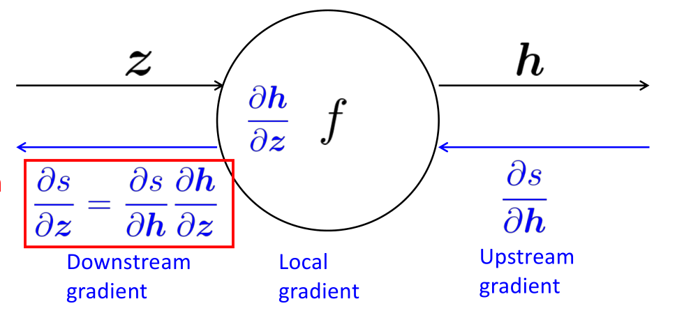
- [downstream gradient] = [upstream gradient] x [local gradient]

**Multiple inputs means multiple local gradients**
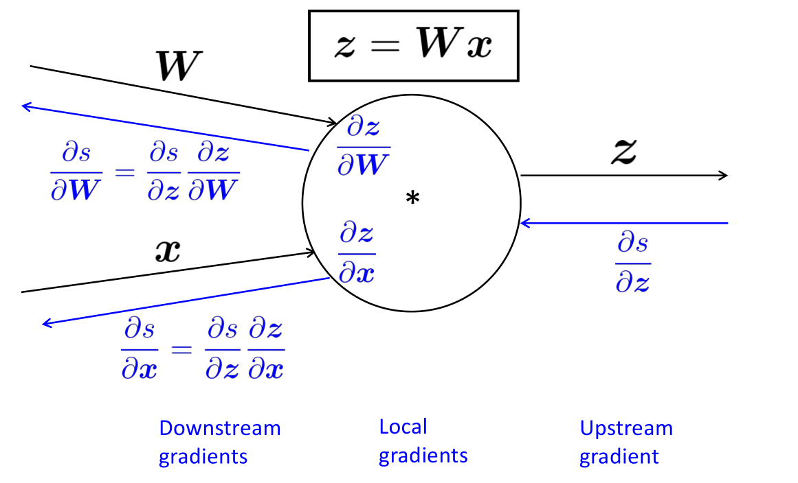

**Gradients sum at outward branches**
Distributes the upstream gradient to each summand:
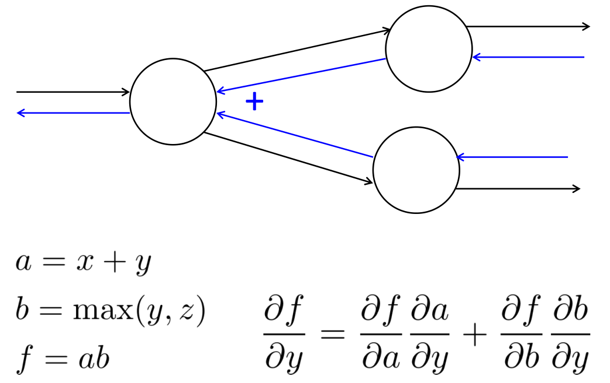

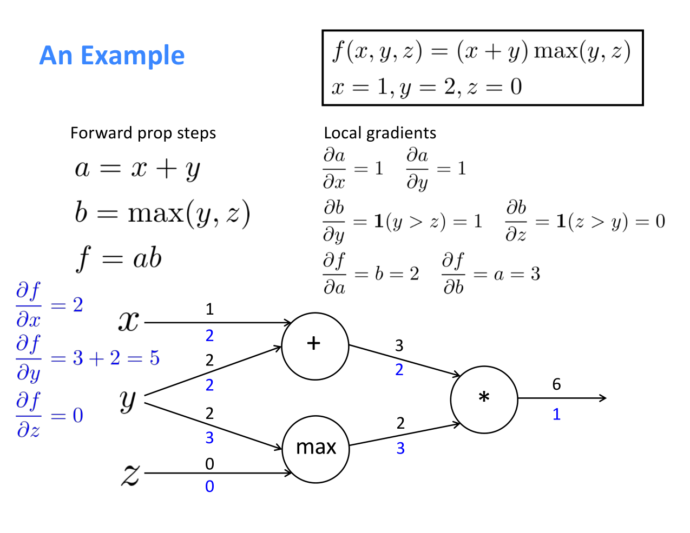
- `+`: *distributes* the upstream gradient
- `max`: *routes* the upstream gradient
- `*`: *switches/flips* the upstream gradient

**Gradient checking: Numeric Gradient**
Slope/two-sided estimate:
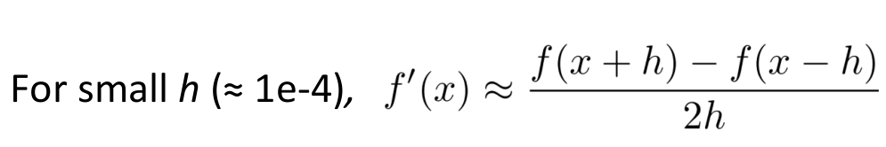
- approximate and very slow, i.e. recompute for every parameter of our model

> In the old days when we hand-wrote everything, it was key to do this everywhere.

## Deep Learning
### Regularization
*prevents overfitting when we have a lot of features/parameters*

A full loss function in practice includes regularization overall parameters:
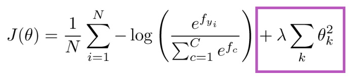

Overfitting/memorization:
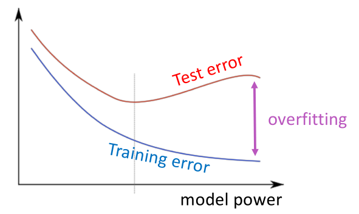

### Nonlinearities
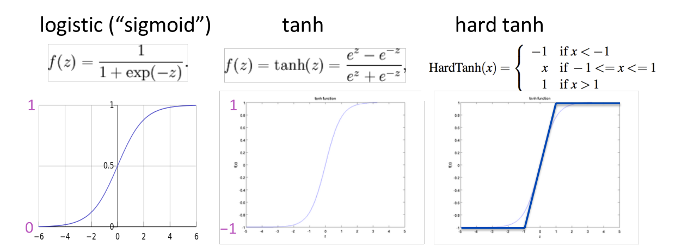
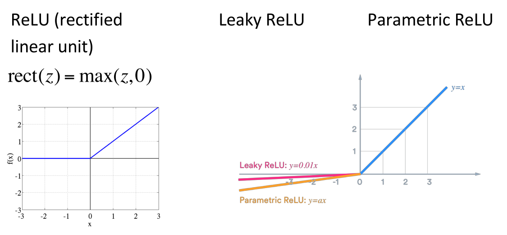
- left: death neurons
- right: identity

### Parameter initialization
Initialize weights to small random values to avoid/break symmetries that prevent learning/specialization

### Optimizers
Adaptive optimizers scale the parameter adjustment by an accumulated gradient, e.g. Adam, RMSprop.

### Learning rates
Better results can generally be obtained by allowing learning rates to decrease as you train

> Fancier optimizers still use a learning rate but it may be an initial rate that the optimizer shrinks 
