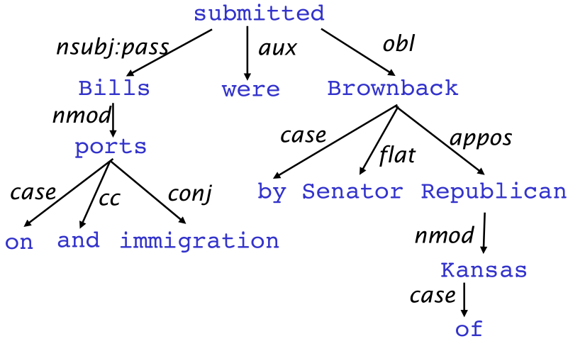
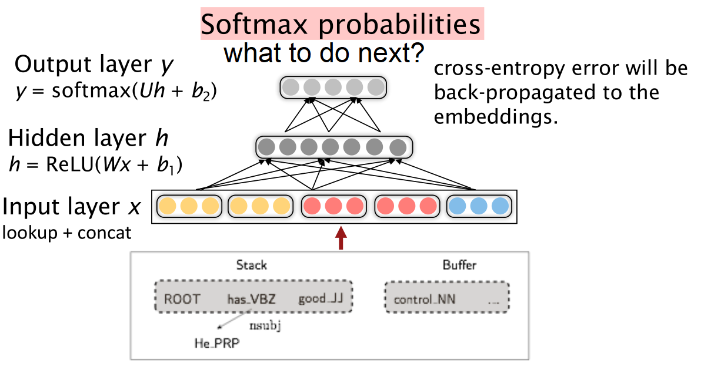

# Dependency Parsing
## Linguistic structure
*we need to known what is connected to what.*

### Phrase structure grammar
Sentences are built from word units/categories that progressively nest:
1. start unit: the, cat, cuddly, by, door
1. combine into phrases: the cuddly cat, by the door
1. combine into bigger phrases: the cuddly cat by the door

### Dependency structure grammar
Words as modifiers of other words recursively:

The arrow connects a head (governor, superior, regent) with a dependent (modifier, inferior, subordinate).

## Dependency parsing
- Dynamic programming
- Graph algorithms
- Constraint Satisfaction
- Transition-based dependency parsing

## Neural dependency parsing
### Distributed Representations

- word embedding: similar words are expected to have close vectors.
- part-of-speech tags (POS) and dependency labels are also represented as d-dimensional vectors.

> bigger, deeper networks with better tuned hyperparameters
