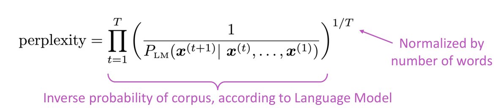

# Language Models and RNNs
## Language Modeling
*task of predicting what word comes next*

A *language model* produces the conditional probability of the next word given previous word. Given a sequence of words \(x^{(1)}, \ldots, x^{(t)}\) compute the probability distribution on the next word \(x^{(t+1)}\):
\[
    P(x^{(t+1)} \vert x^{(t)}, \ldots, x^{(1)})
\]
- \(x^{(t+1)}\): any word in the vocabulary \(V = \{w_1, \ldots, w_{\vert V \vert} \}\)
- classification task because there's a predefined number of possibilities

A language model also is a system that assigns probability to a piece of text as the product of conditional probabilities in a recurrent form:

> predicting next words gives you a system that can give the probability of a given piece of text

### n-gram language models
*Collect statistics about how frequent different n-grams are, and use these to predict next word.*

A n-gram is a chunk of \(n\) consecutive words:

n-gram language models make a simple assumption, which is that the next word \(n\) or \(x^{(t+1)}\) only depends on the preciding \(n-1\) words:

- obtain \(n\)-gram and \((n-1)\)-gram by counting/frequency in some large corpus of text

Suppose we're learning a 4-gram language model, condition on the previous \(n-1=3\) words:

- if we know that the context is, e.g. the proctor and the clock, then it should be exams.

> we can use a language model to generate text

**Problem**
- simplifying assumption: throw away too much context
    - then we are not as good as predicting the words as we would be if we kept the context
- sparsity: if no n-gram event happens / not much granularity in the probability distribution
    - zero probability to that event, and worse with large \(n\), so typically is set to 5
    - using *smoothing*, everything has at least a small probability
    - using *back-off* in failure cases to use \((n-1)-1\)-grams
- model size: store count for all n-grams you saw in the corpus
    - increasing \(n\) or corpus also increases the model size

#### Generating text with a n-gram Language Model

> surprisingly grammatical but incoherent

### neural language model
The language model task is:
- inputs: sequence of words \(x^{(1)}, \ldots, x^{(t)}\)
- outputs: probability distribution on the next word \(P(x^{(t+1)} \vert x^{(t)}, \ldots, x^{(1)})\)

#### A fixed-window neural language model
*context*

- no sparsity problem: outputs probability distribution even for unseen events
    - may not be the best probability but it will run
- no storage problem: no need to store all possible observed n-grams
    - just need to store all of the word vectors in our vocabulary of size \(\vert V \vert\)

**Problems**
- fixed window is too small: can neven be large enough
    - enlarging window size also enlarges weight matrix \(W\) because it gets multiplied by a concatenation of word vectors
- no symmetry: in how the inputs are processed
    - all words in a given window are multiplied by different/independent/separate weights in \(W\)
    - what we learn in one *section* is not shared with the others (inefficient)

> we need an architecture that can process any length input rather than a fixed size window

## Recurrent Neural Network (RNN)
Apply the same weights \(W\) repeatedly:

- inputs have a sequence of hidden states / time-steps
- each hidden state is computed on the previous and on the corresponding input
- output \(\hat{y}\) are optional, we can compute them on just some steps and not others

> we can process any length input we want because we apply the same transformation on every step

- initial hidden state \(h^(0)\): network parameter learn how to initialize it, or assume zero vector.
- \(h^{t}\): uses the previous hidden state \(h^{(t-1)}\), current input \(e^{(t)}\) and optional bias term \(b_1\)

In practice, we choose how log the inputs are in training.

> learn a general representation of language given the context so far

**Advantages**
- can process any input length
- use information from past steps
- models size doesn't increase for longer input
- input symmetry efficiency: applies ame transformation to each input

**Disadvantages**
- hidden state recurrent/sequential computation is slow
- in practice, is difficult to access information from many steps back

### Train a RNN Language Model

1. get a big corpus of text:
    - sequence of words as shorter unit of text
1. compute output distribution \(y^{(t)}\) for every step \(t\) using the RNN
    - predict probability distribution of every word given words so far
1. loss function on step \(t\) is cross-entropy or negative log probability because we use one-hot as labels:
    \[
        J^{(t)}(\theta) = CE(y^{(t)}, \hat{y}^{(t)}) = - \sum_{w \in V} y^{(t)}_ w \log \hat{y}^{(t)}_ w = - \log \hat{y}^{(t)}_{x _{t+1}}
    \]    
    - predicted probability distribution \(y^{(t)}\)
    - true next word \(y^{(y)}\) as one-hot for \(x^{(t+1)}\)
1. average previous loss to get overall loss:
    \[
        J(\theta) = \frac{1}{T} \sum_{t=1}^T J^{(t)}(\theta) = \frac{1}{T} \sum_{t=1}^T - \log \hat{y}^{(t)}_{x _{t+1}}
    \]

Stochastic gradient descent allows us to compute loss and gradients for small chunk of data and update, so we repeatedly compute the overall loss \(J(\theta)\) for a batch of sentences, then compute the gradients and update the weights.

#### Backpropagation through time
The gradient of \(J^{(t)}(\theta)\) with respect to a repeated weight matrix \(W_h\) is the sum of the gradient w.r.t each time it appears on the \(i\)-th step:
\[
    \frac{\partial J^{(t)}}{\partial W_h} = \sum_{i=1}^t \frac{\partial J^{(t)}}{\partial W_h} \bigg\vert_{(i)}
\]

Backpropagate over timesteps \(i=t, \ldots, 0\) summing gradients as we go:

> compute gradients by accumulating in terms of the previous one

### Generating text with a RNN Language Model
Generate text by repeated sampling outputs as next inputs:

## Evaluating Language Models
*predicting what word comes next is a benchmark task that helps us measure our progress*

### Perplexity
*weighted equivalent branching factor / average predictability*

The inverse probability of thw whole corpus according to the language model normalized by number of words, i.e. normalized probability of a long sequence of words:

- compute as the product of probabilities of every word given the past so far by chain rule of probability
- normalize by number of words

Minimizing perplexity is the same as maximizing probability, i.e. asking how many things can occur in each time weighted by their probability.

> lower perplexity is better because is the inverse probability of the corpus, i.e. language model to assigns high probability to the corpus.

This is equal to the exponential of the cross-entropy loss \(J(\theta)\), the training objective of the language model:
\[\begin{align}
    \prod_{t=1}^T \bigg( \frac{1}{\hat{y}^{(t)}_{x _{t+1}}} \bigg)^{1/T}
    &= \exp \bigg(\frac{1}{T} \sum_{t=1}^T - \log \hat{y}^{(t)}_{x _{t+1}} \bigg)
    &= \exp \big( J(\theta) \big)
\end{align}\]

> if we're training the language model to minimize the cross-entropy loss, then we are training it to optimize the perplexity as well.

### RNNs examples
#### RNNs can be used for tagging

#### RNNs can be used for sentence classification

#### RNNs can be used as an encoder module

#### RNN-LMs can be used to generate text

## Summary
*RNNs are a great way to build a LM*
- Language Model: system that predicts the next word
- Recurrent Neural Network (RNN)
    - take sequential input of any length
    - apply the same weights on each step
    - can optionally produce output on each step
