# Vanishing Gradients, Fancy RNNs
## Vanishing gradient intuition
*accumulated multiplication of small gradients*

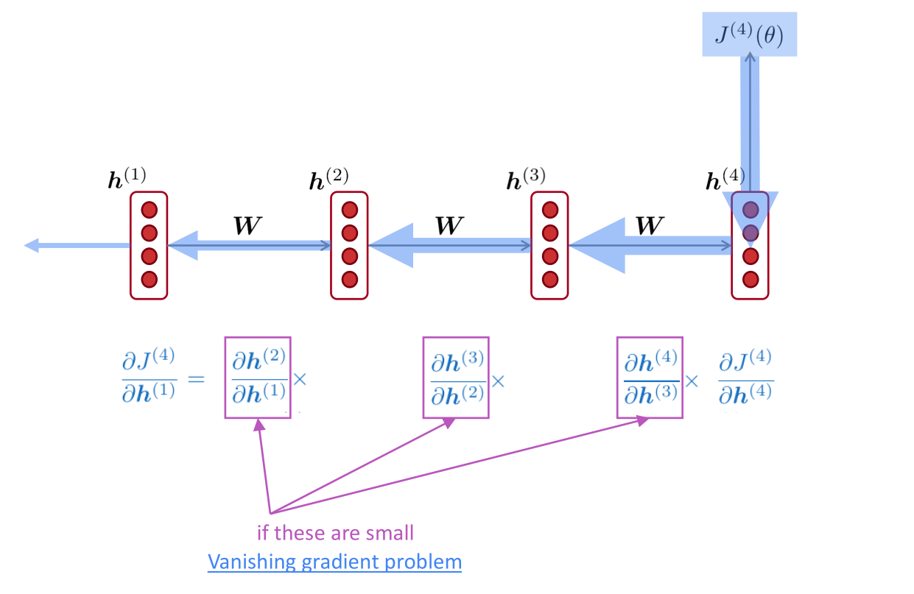

When intermediate gradients are small, then our overall gradient is gonna get smaller and smaller (vanishing) because the accumulated gradient is the product of all these intermediate gradients.

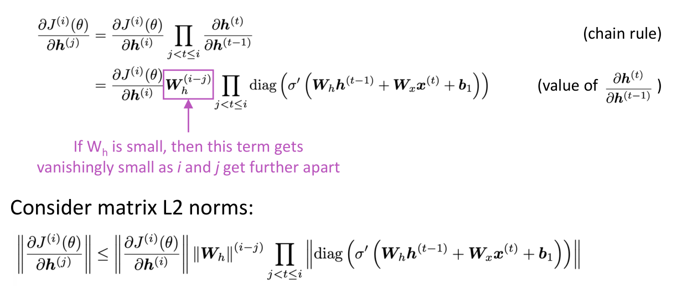
- if the largest eigenvalue of \(W_h \lt 1\) then vanishing gradients
- if the largest eigenvalue of \(W_h \gt 1\) then exploding gradients

> the bound is 1 because we have sigmoid nonlinearity

### Vanishing gradient as a problem
*gradients as the effect of the past on the future*

Gradient signal from faraway is lost because it’s much smaller than gradient signal from close-by:
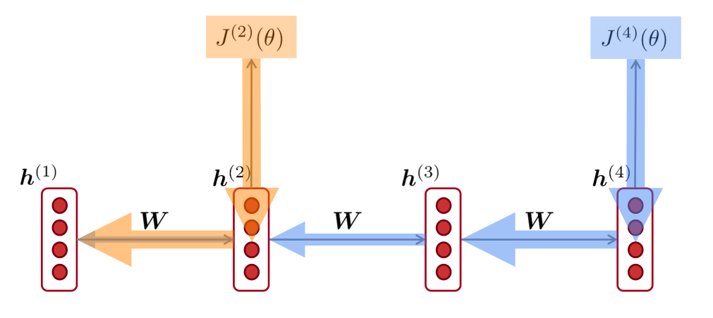

Only learn/optimize with respect to nearby effects and not the long-term effects, then we can't tell the relation between step \(t\) and \(t+n\) in the data:
- actually no dependency, i.e. nothing to be learned
- wrong parameters to capture the true dependency/connection

Difficult for an RNN to learn to preserve information over many timesteps, i.e. the model can't learn long-distance dependencies because in a vanilla RNN, the hidden state is constantly being rewritten.

> model weights are only updated only with respect to near effects, not long-term effects.

Due to vanishing gradient, RNN-LMs are better at learning from *sequential recency* than *syntactic recency*:
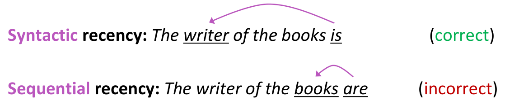

### Exploding gradient as a problem
*bad updates*

If the gradient becomes too big, then the SGD update step becomes too big:
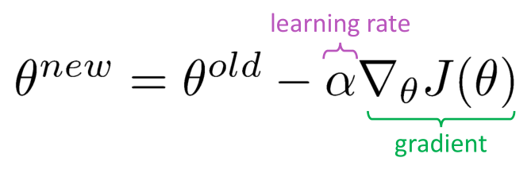

We take too large a step and reach a bad parameter configuration (with large loss, e.g. Inf or NaN).

#### Gradient clipping
*solution for exploding gradient*

If the norm of the gradient is greater than some threshold, scale it down before applying SGD update:
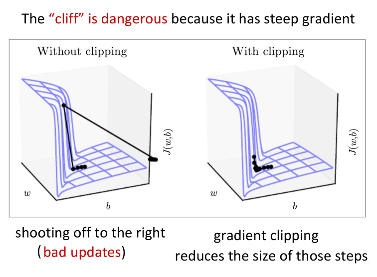
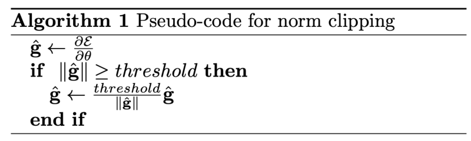

> same direction, but with a smaller in magnitude step

## Types of RNN
- LSTM
- GRU

### Long Short-Term Memory (LSTM)
The LSTM can erase, write and read long-term information from the cell:
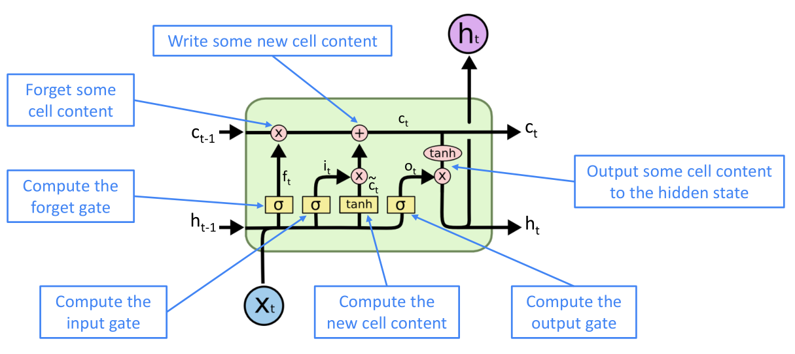

The selection of which information is erased/written/read is controlled by three corresponding gates that work between open (1) and closed (0).

> The gates are dynamic: their value is computed based on the current context

All vectors from the same length \(n\):
- \(f^{(t)}\) forget gate controls what is kept vs forgotten from the previous cell state \(c^{(t-1)}\)
- \(i^{(t)}\) input gate controls what parts of the new cell content \(\tilde{c}^{(t)}\) are written to the current cell state \(c^{(t)}\)
- \(o^{(t)}\) output gate controls what parts of the cell are output to hidden state
- \(\tilde{c}^{(t)}\) new cell content to be written in the cell \(c^{(t)}\)
- \(c^{(t)}\) current cell state (input) that
    - forget/erase previous content \(c^{(t-1)}\)
    - write/add new  content \(\tilde{c}^{(t)}\)
- \(h^{(t)}\) hidden state (output) read content from the cell

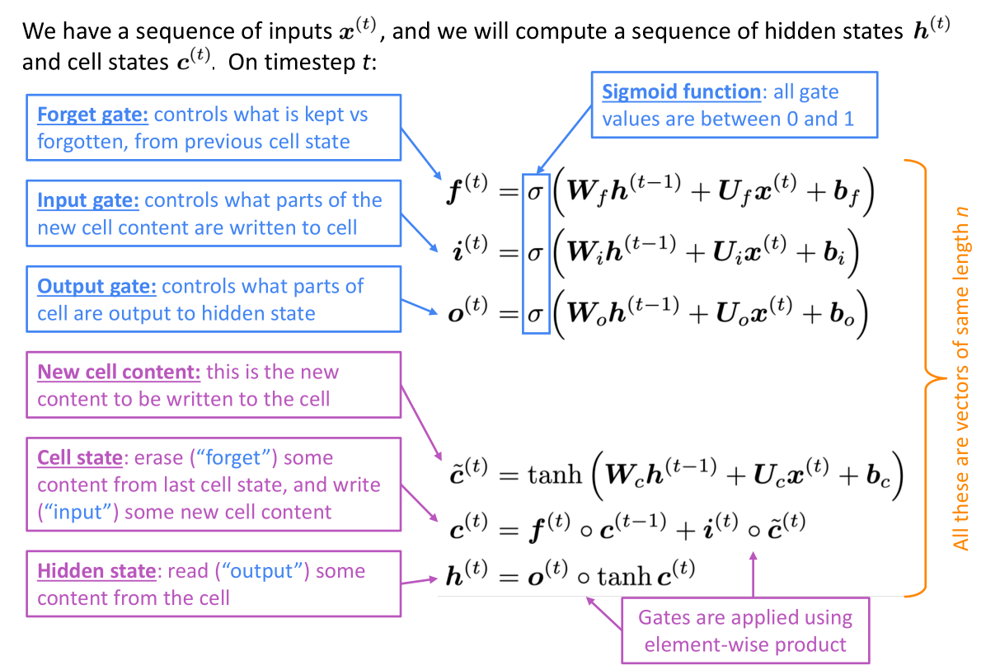

LSTM will suffer from vanishing gradients as well, but not nearly as much as the vanilla RNN.

> Hidden states \(h^{(t)}\) are the *outputs* from the RNN, cell states \(c^{(t)}\) are not accessible (not passed)

### Gated Recurrent Units (GRU)
*no cell*

The GRU is quicker to compute and has fewer parameters:
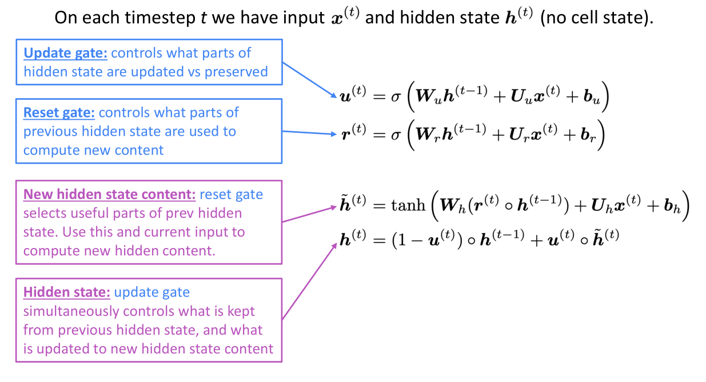
- single gate \(u\) decides to remember or update

## vanishing/exploding gradient in neural architectures
Due to chain rule / choice of nonlinearity function, gradient can become vanishingly small as it backpropagate, thus lower layers are learnt very slowly (hard to train). We need to add more direct connections (thus allowing the gradient to flow).

### Identity residual/dense/skip connections
The identity connection preserves information by default:
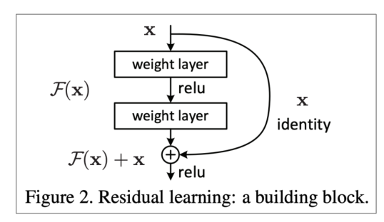

Highway connections are similar to residual connections, but the identity connection vs the transformation layer is controlled by a dynamic gate.

## RNN Flavors
- Bidirectional
- Multi-layer

### Bidirectional RNNs
Concatenated hidden states can be regarded as the outputs of the bidirectional RNN:
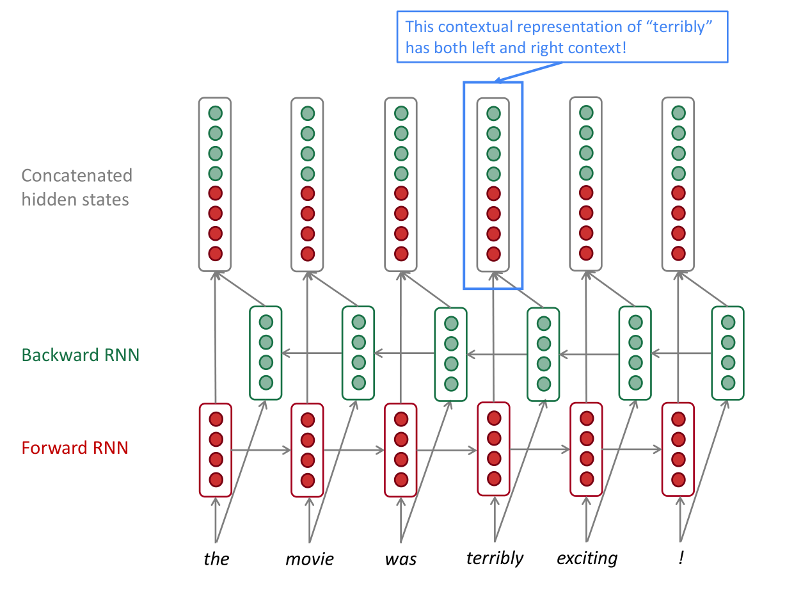
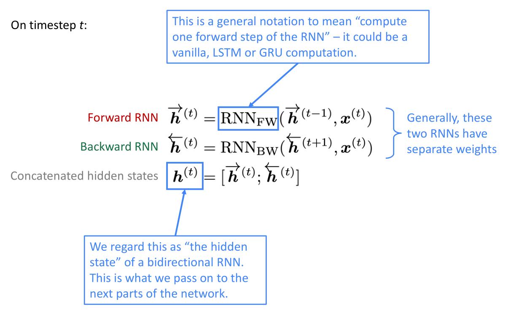

> they are not applicable to Language Modeling, because in LM you only have left context available, i.e. no access to the entire input sequence at once.

### Multi-layer / stacked RNNs
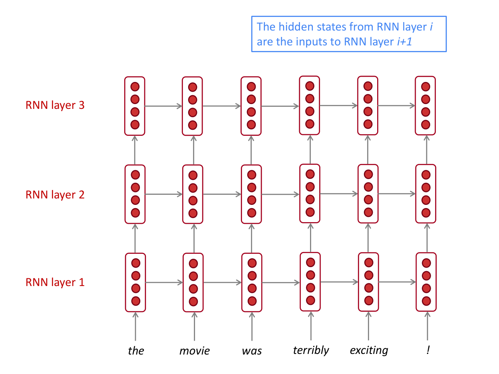
- lower RNNs should compute lower-level features
- higher RNNs should compute higher-level features.

## Summary
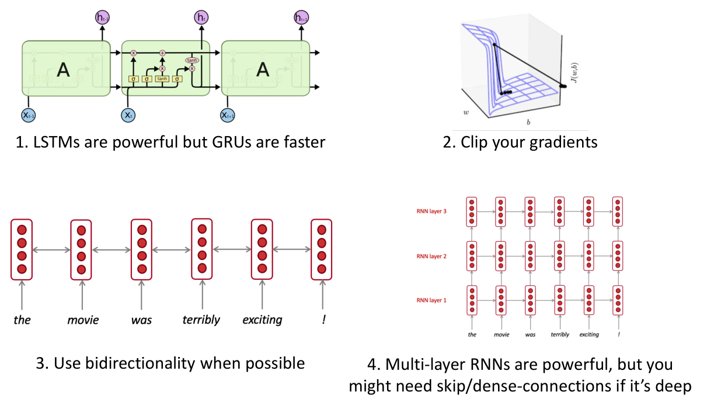

> Though vanishing/exploding gradients are a general problem, RNNs are particularly unstable due to the repeated multiplication by the same weight matrix.

**Fixes for vanishing (or exploding) gradient:**
- Gradient clipping
- Skip connections

**Types of RNN:**
Use gates to control information flow; they are more resilient to vanishing gradients
- LSTM
- GRU

**RNN Flavors**
- Bidirectional
- Multi-layer
