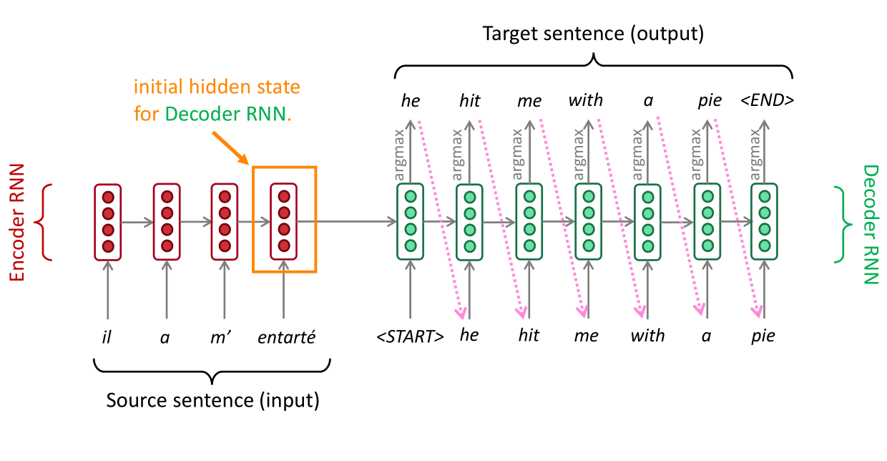

# Translation, Seq2Seq, Attention
*Machine Translation or sequence-to-sequence*

Statistical Machine Translation (SMT) systems, built by hundreds of engineers over many years were outperformed by Neural Machine Translation (NMT) systems trained by a handful of engineers in a few months to become the leading standard method.

## Neural Machine Translation (NMT)
The neural network architecture is called sequence-to-sequence (seq2seq), from source sequence to target sequence, this is an example of a Conditional Language Model:
- conditional because its predictions are also conditioned on the source sentence \(x\)
- language Model because the decoder is predicting the next word of the target sentence \(y\)

- better performance, more fluent
- better use of context and phrase similarities

A single neural network to be optimized end-to-end:
- no subcomponents to be individually optimized
    - Same method for all language pairs
- requires much less human engineering effort (no feature engineering)

> NMT is less interpretable, hard to debug and difficult to control (safety concerns)

### sequence-to-sequence (seq2seq)

1. Encoder RNN produces an encoding of the source sentence
    - Provides initial hidden state for Decoder RNN
1. Decoder RNN is a conditional Language Model that generates target sentence, conditioned on encoding, i.e. initial hidden state.
    - decoder output is fed in as next step’s input
    - e.g. *greedy decoding*: take most probable word on each step

Usually uses two separate sets of word embeddings, one for encoding and another for decoding.

> test time behavior: we feed the current output as next input, in training we feed all the labels at once.

### Training a Neural Machine Translation system
Seq2seq is optimized as a single system, backpropagation operates end-to-end:

1. get a sentence pair from your parallel corpus (original and translation text)
1. feed the sentence into the encoder RNN
    - pass the final hidden state to be the initial hidden state of the decoder
1. feed the target sentence into the decoder RNN
    - produce the probability distribution of what comes next \(\hat{y}\)
1. compute cross entropy loss, i.e. negative log-likelihood of the true/correct next word
1. average all of these losses to get the total loss

During training you don't feed the token that you produced into the next step, rather you feed the target/true sentence from the corpus, i.e. you don't use what the decoder predicts on a step.

> Backpropagation flows throughout the entire system, and you learn the entire system with respect to this single loss.

### Decoding
#### Greedy decoding
Take the best option that you can see right now, and then you really don't have a way to go back, i.e. *local biased* so its not necessarily gonna give you the argmax over the entire sentence:
- we decode until the model produces a `<END>` token

> Greedy decoding has no way to undo decisions!

#### Exhaustive search decoding
Computing all possible sequences is far too expensive

#### Beam search decoding
*search for high-scoring hypotheses, tracking top k on each step*

On each step of decoder, keep track of the \(k\) most probable partial translations (*hypothesis*) with its log probability as scoring function.

> Beam search is not guaranteed to find optimal solution but much more efficient than exhaustive search!

Compute the score of these \(k = 2\) hypotheses given by the log probability of the current word given the context so far:

1. start with `<START>` token
    - compute/calculate the probability distribution of next word and take the top \(k\)
    - score as the log-probability of the word given the context so far, i.e. the `<START>` token
1. for each \(k\) hypothesis we find the top \(k\) words that come next, i.e. expanding
    - score as the log probability of this new word given the context so far
    - plus, the score so far because we accumulate the sum of low probabilities.
    - of these \(k^2\) hypotheses, just keep \(k\) with highest scores

> branch \(k\), keep top \(k\) and accumulate probabilities

Different hypotheses may produce `<END>` tokens on different timesteps, we place it aside and continue exploring others until the *stopping criteria* / pre-defined cutoff is matched:
- reach timestep \(T\)
- have at least \(n\) completed hypotheses

> during beam search, we only compare scores of hypotheses that have the same length.

Once we have a collection of completed hypothesis, we select the top one but shorter sequences have higher probabilities and longer hypotheses have lower scores, i.e. *short translation bias*. We normalize by length \(t\) and use this to select the top one instead:
\[
    \frac{1}{t} = \sum_{i=1}^t \log P_\text{LM} (y_i \vert y_1, \ldots, y_{i-1}, x)
\]
- probability of next word \(y_i\), given past words so far \(y_1, \ldots, y_{y-1}\) and source sentence\(x\)

## Machine Translation Evaluation
### BLEU (Bilingual Evaluation Understudy)
Compares the machine-written translation to several human-written translation(s), and computes a similarity score based on:
- n-gram precision (usually for 1, 2, 3 and 4-grams)
- plus a penalty for too-short system translations

Useful but imperfect because there are many valid ways to translate a sentence, so a good translation can get a poor BLEU score because it has low n-gram overlap with the human translation.

### Difficulties in Machine Translation
- Out-of-vocabulary words in source or target vocabulary
- domain mismatch between train and test data
    - from Wikipedia to medical
    - NMT picks up biases in training data
- maintaining context over longer text
    - condition on larger pieces of context without it becoming too expensive
- low-resource language pairs

Common sense is still hard:

Biases in training data:

Uninterpretable systems do strange things:

- often for low resource languages, one of the best resources of parallel text is the Bible.
- can't condition on noise, we don't have useful information from the sentence on the left

One downside of uninterpretability is that really weird effects can happen, you don't see them coming and it's not always even easy to explain why they happened.

> you don't know that this is going to happen until it happens.

## Attention
*a new vanilla*

### Attention is a general Deep Learning technique
*query attends to the values*

Given a **set of vector** values, and a query vector, attention computes a weighted sum of the values **dependent on the query**. In seq2seq, the decoder hidden state a given timestep \(s_t\) is the query that attends to all the encoder hidden states values:
- *selective summary* via weighted sum
    - how much information of the values is determined by the query as attention/focus
- *fixed-size representation of set values*
    - representation depends on other representation, the query

### Attention intuition
In RNNs a single vector is the encoding of the source sentence (*information bottleneck*), i.e. a single vector must be a good representation of the encoder. with Attention, on each step of the decoder we use direct connections to the encoder to focus on a particular part of the source sequence (seq2seq with attention):

1. attention score for each of the source words
    - dot-product between all of the encoder hidden states and the first the decoder hidden state
1. attention distribution (softmax)
    - softmax to turn scores into a probability distribution
1. attention output (weighted sum)
    - use attention distribution as the weight to sum of the encoder hidden states
    - i.e. weight each encoder hidden state according to how much attention distribution it has on them
1. compute next word prediction \(\hat{y}_1\)
    - concatenate the attention output with the decoder hidden state
    - i.e. attention output to influences/conditions the next word prediction

> The attention output mostly contains information from the hidden states that received high attention.

On the next step, we use the second decoder hidden state, then we take the dot-product with all of the encoder hidden states, get the softmax over that to get the attention distribution. Here we have a soft-alignment, i.e. each word has a distribution over the corresponding words in the source sentence:

> sometimes we take the attention output from the previous step, and also feed it into the decoder (along with the usual decoder input)

### Attention equations
1. encoder hidden states \(h_1, \ldots, h_N \in \mathbb{R}^h\)
1. on timestep \(t\), decoder hidden state \(s_t \in \mathbb{R}^h\)
1. on timestep \(t\), attention scores \(e^t\):
    \[
        e^t = [s_t^T h_1, \ldots, s_t^T h_N] \in \mathbb{R}^N
    \]
    - dot product of decoder hidden  state \(s_t\) with each of the encoder hidden states \(h_1\)
    - vector of same length as the encoder
    - \(\cdot^T\) transpose operation
1. on timestep \(t\), attention distribution \(\alpha^t\):
    \[
        \alpha^t = \text{softmax}(e^t) \in \mathbb{R}^N
    \]
1. on timestep \(t\), attention output \(a_t\)
    \[
        a_t = \sum_{i=1}^N \alpha^t_i h_i \in \mathbb{R}^h
    \]    
    - weighted sum of the encoder hidden states
    - same size as the encoder hidden states
1. concatenate with decoder hidden state:
    \[
        [a_t; s_t] \in \mathbb{R}^{2h}
    \]

### Attention advantages
- Attention solves the bottleneck problem
    - Attention allows decoder to look directly at source; bypass bottleneck
- Attention helps with vanishing gradient problem
    - direct connection between the encoder and the decoder, i.e. shortcut to faraway states
- Attention provides some interpretability
    - attention distribution as soft alignment

> The network learned alignment by itself

### Attention variants
- values \(h_1, \ldots, h_N \in \mathbb{R}^{d_1}\) and a query \(s \in \mathbb{R}^{d_2}\)

Attention always involves:
1. computing *attention scores* \(e \in \mathbb{R}^N\)
    - dot-product attention: \(e_i = s^T h_i \in \mathbb{R}\), where \(d_1 = d_2\)
    - multiplicative attention: \(e_i = s^T W h_i \in \mathbb{R}\), where \(W \in \mathbb{R}^{d_2 \times \d_1}\) learnable weight matrix
    - additive attends: \(e_i = v^T \sigma(W_1 h_i + W_2 s) \in \mathbb{R}\), add linear transformations then pass through a non-linearity
        - \(d_3\): attention dimensionality
        - weight matrix \(W_1 \in \mathbb{R}^{d_3 \times d_1}\)
        - weight matrix \(W_2 \in \mathbb{R}^{d_3 \times d_2}\)
        - weight vector \(v \in \mathbb{R}^{d_3}\)
1. then, *attention distribution* \(\alpha = \text{softmax}(e) \in \mathbb{R}^N\)
1. obtain the *attention output* / context vector via weighted sum of values:
    \[
        a = \sum_{i=1}^N \alpha_i h_i \in \mathbb{R}^{d_1}
    \]
