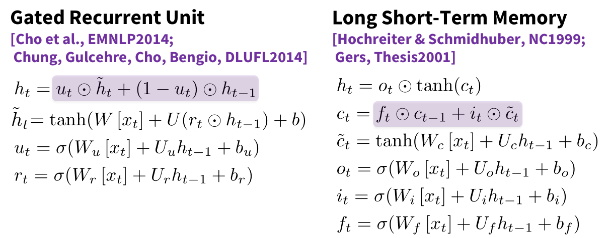
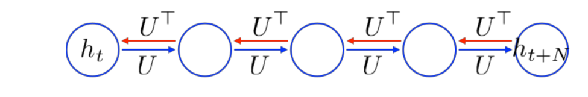
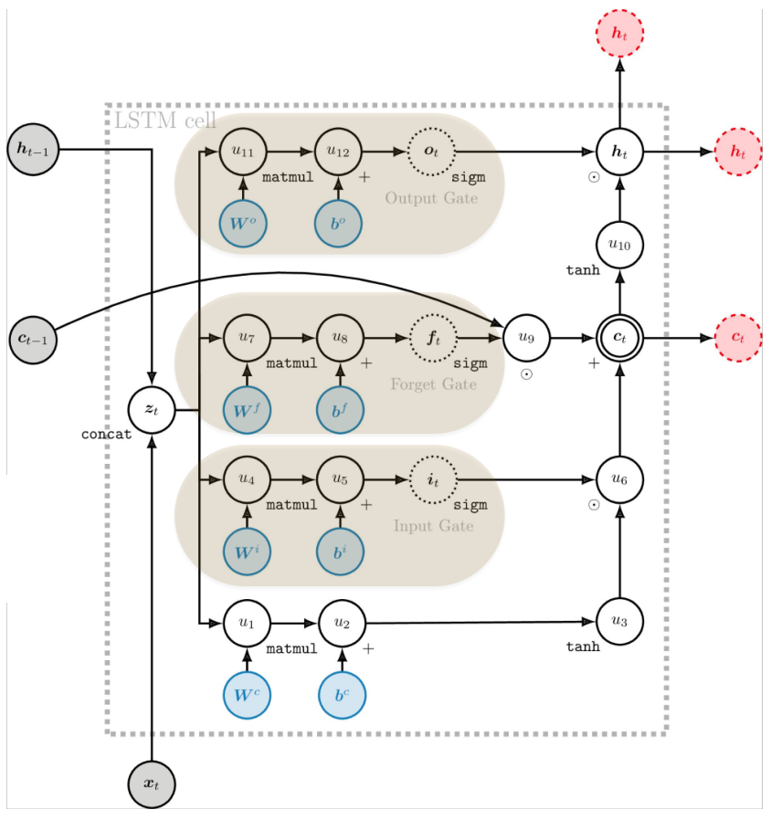
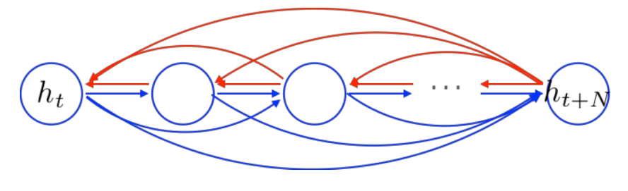
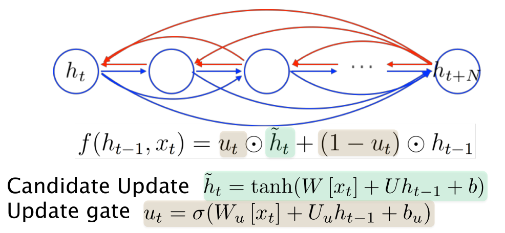
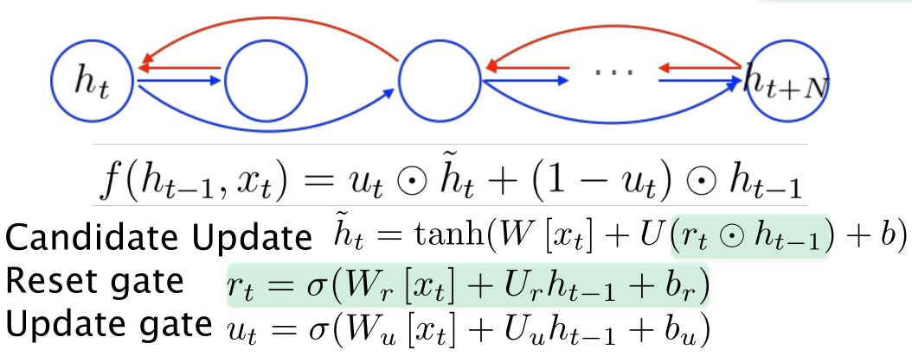

# Practical Tips for Projects
- [Nails] start with a (domain) problem of interest and try to find good/better ways to address it than are currently known/used
- [Hammers] technical approach of interest, and work out good ways to extend or improve it or new ways to apply it

**Pipeline**
1. Define Task, e.g. Summarization
1. Define Dataset
1. Dataset hygiene (train-dev and test splits)
1. Define your metric, e.g. Rouge
1. Establish a baseline
    - simplest model first, e.g. logistic regression on averaging word vectors
1. Implement existing neural net model

**Data**
- visualize the dataset
- collect summary statistics
- analyze output and errors on train and dev
- analyze how different hyperparameters affect performance

**Work incrementally**
- start with a very simple model and get it to work
- initially run on a tiny amount of data, e.g. 8 examples
- run your model on a large dataset
- generalize to avoid overfitting

**Writeup**
1. Abstract and Introduction
1. Prior related work
1. Model
1. Data
1. Experiments
1. Results
1. Analysis & Conclusion

## Gated Recurrent Units (GRU)

### Backpropagation through Time
*Vanishing gradient*

We have to backpropagate through every intermediate node and that's where our gradients disappear:

RNNs measure the influence of the past on the future. When gradient goes to zero, we cannot tell whether:
1. no dependency between \(t\) and \(t + n\) in data
1. wrong configuration of parameters (vanishing gradient)

> the temporal derivative leads to vanishing

### LSTM
LSTM gates all operations (input, past, output):

Shortcut: rather than multiplying, we sum to obtain a direct/linear connection.

### Gated Recurrent Units (GRU)
*gate calculates a value between zero to one*

**Attention**
*Create shortcut connections*
Shortcuts connections in every timestep but doesn't remember the position of things.

**Update gate:**
*Create adaptive/weighted shortcut connections*

**Reset gate:**
*Prune unnecessary connections adaptively*

