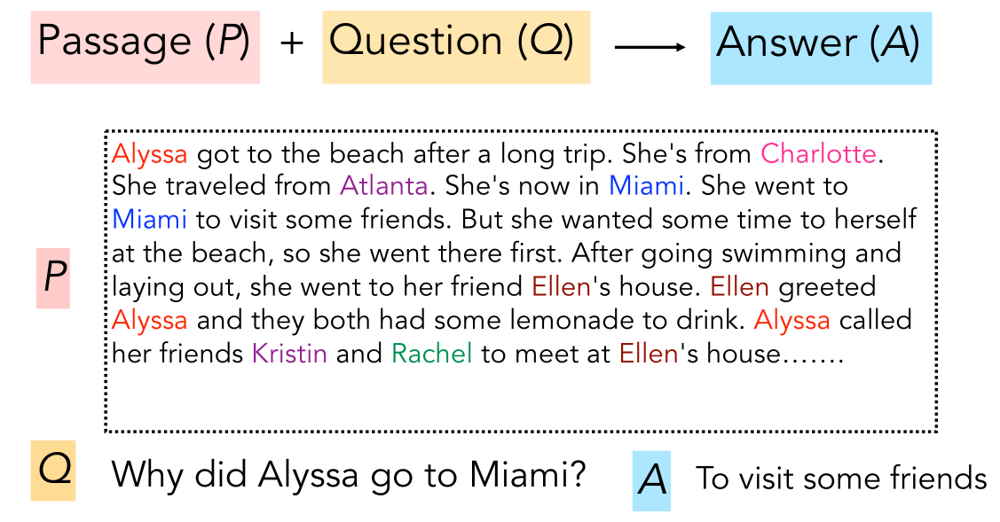
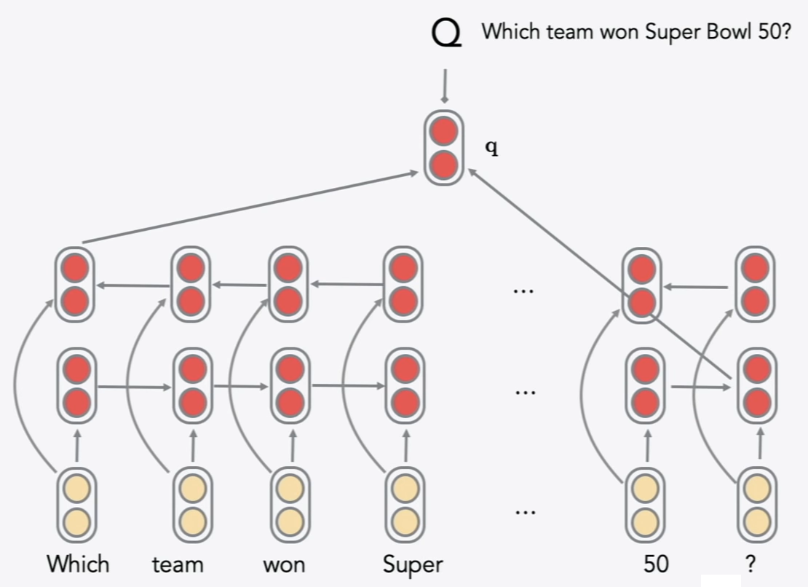
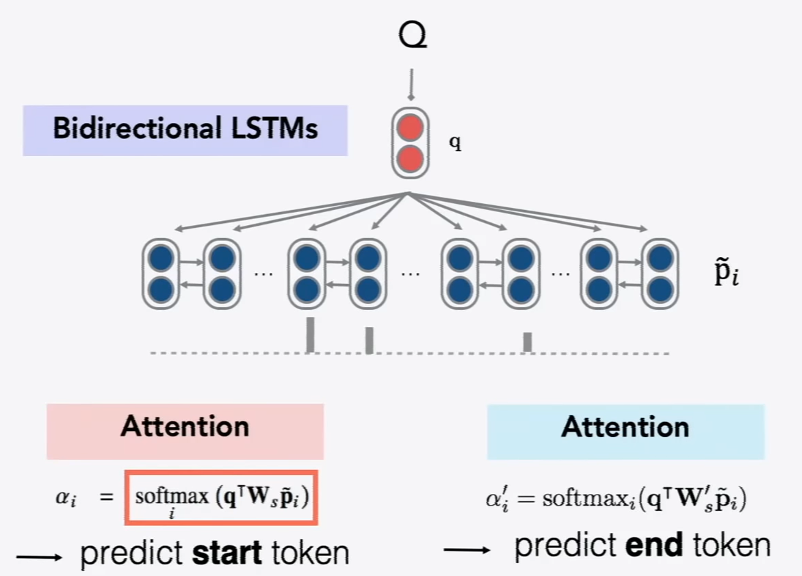
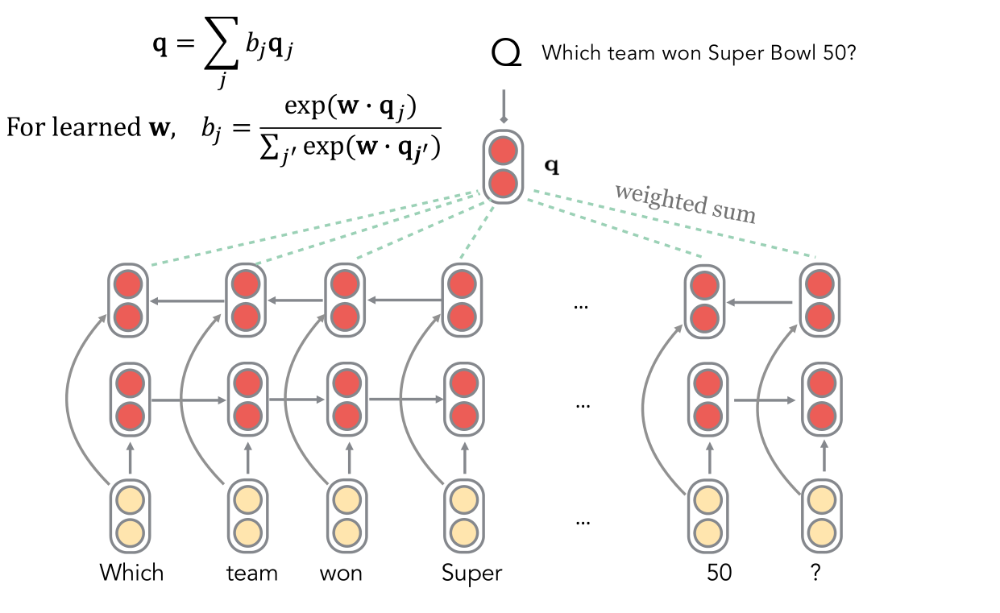
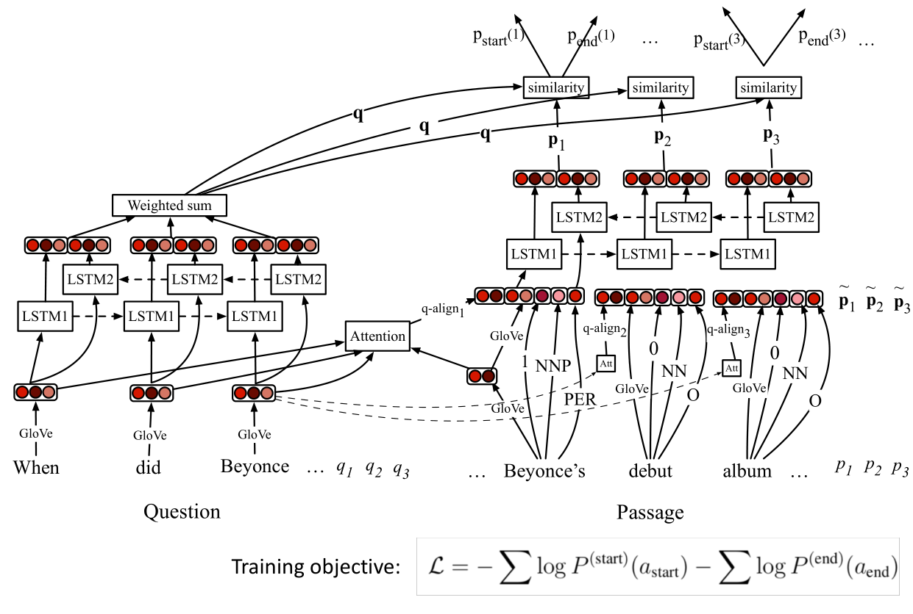
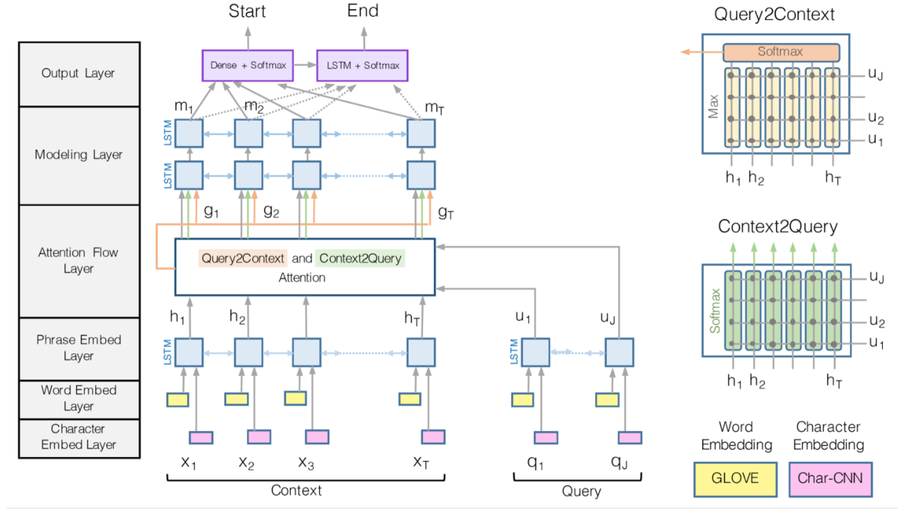
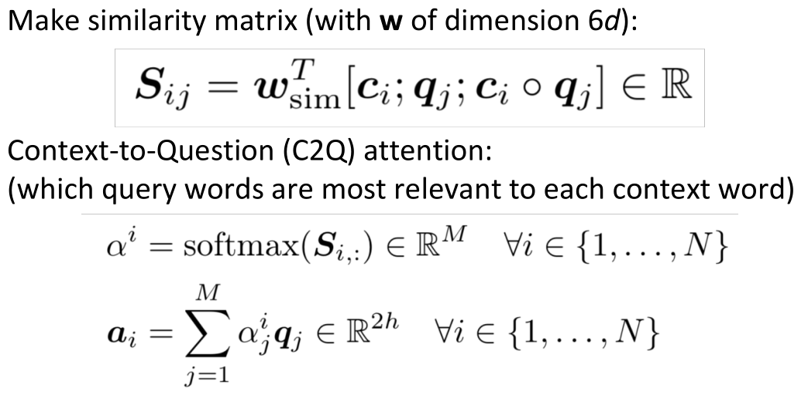
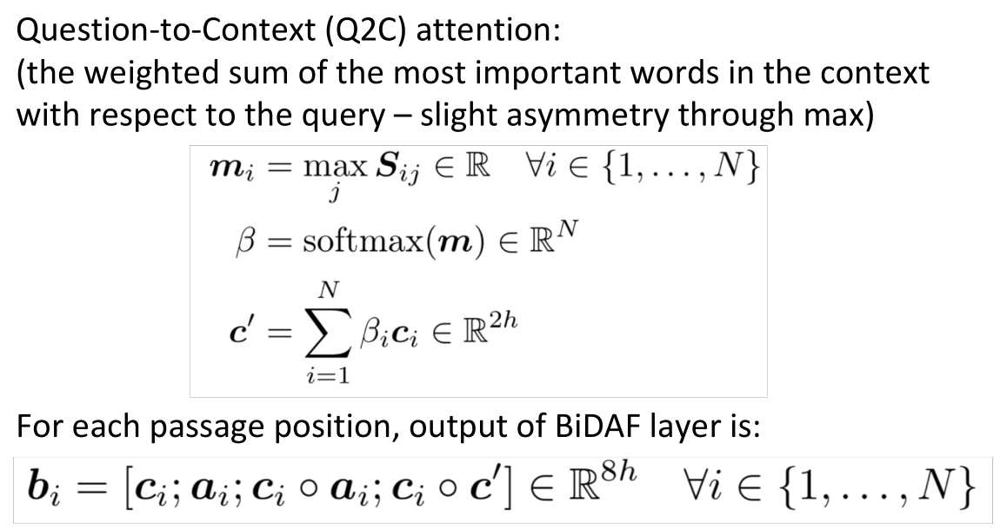
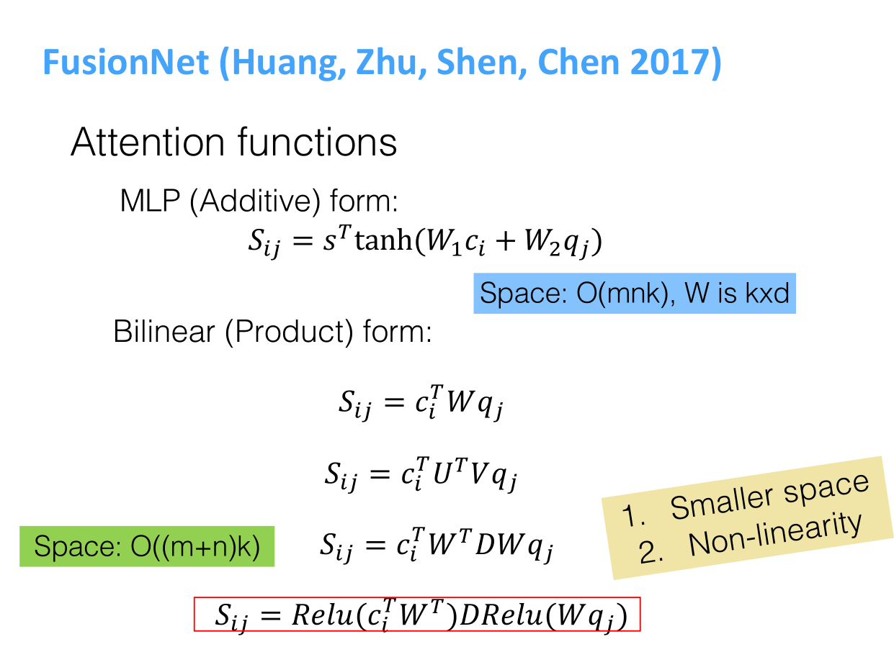
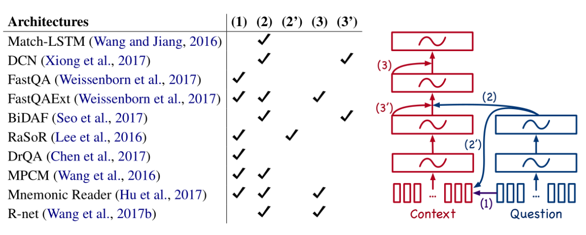

# Question Answering
Simply returning relevant documents is of limited use, we often want answers to our questions.We can factor this into two parts:
1. Information Retrieval
    - finding documents that (might) contain an answer
1. Reading Comprehension
    - finding an answer in a paragraph or a document

**Machine Comprehension (MC)**

## Stanford Question Answering Dataset (SQuAD)
- *extractive question answering*: answer must be a span in the passage.
- only span-based answers (no yes/no, counting, implicit why)

## Stanford Attentive Reader
Question representation and attention to start and end token:

> uses last n-representation

## Stanford Attentive Reader++

> uses representation concatenation

## Bi-Directional Attention Flow for Machine Comprehension (BiDAF)

Attention Flow layer: from the context to the question and from the question to the context:

## FusionNet

## ELMo and BERT preview
*Contextual word representations*
