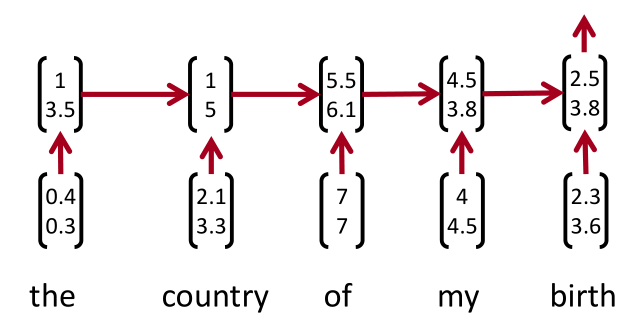
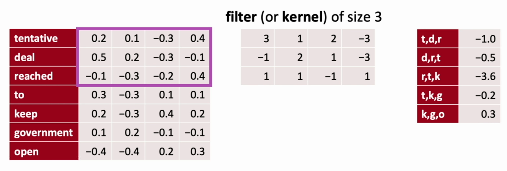
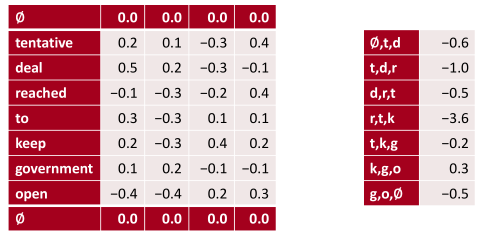
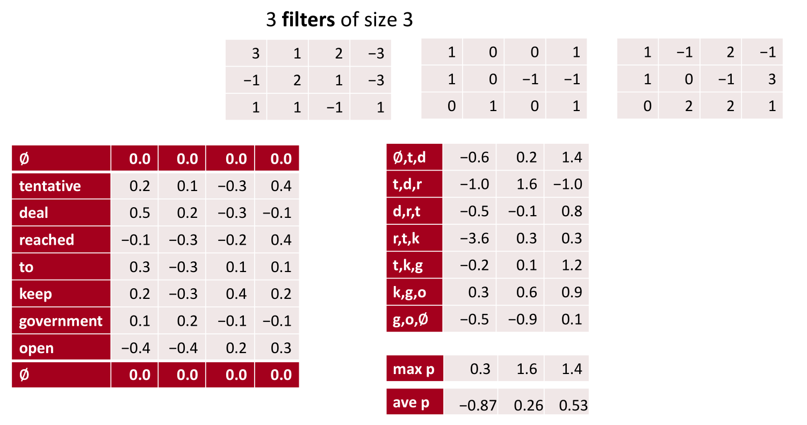
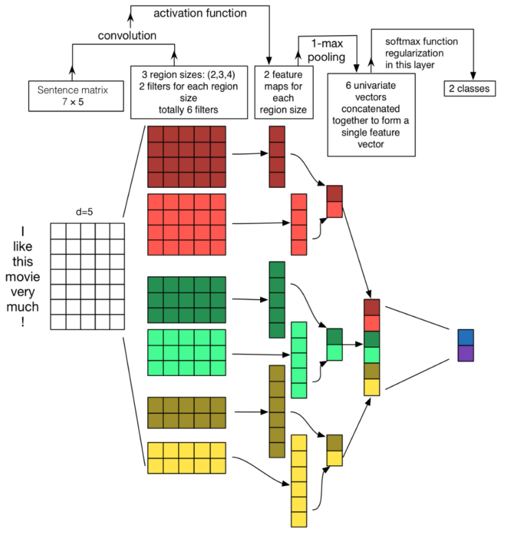
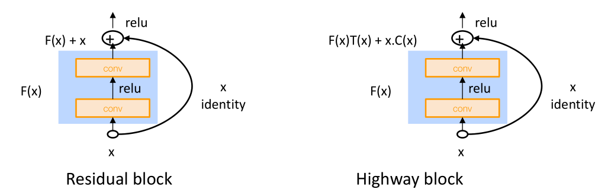
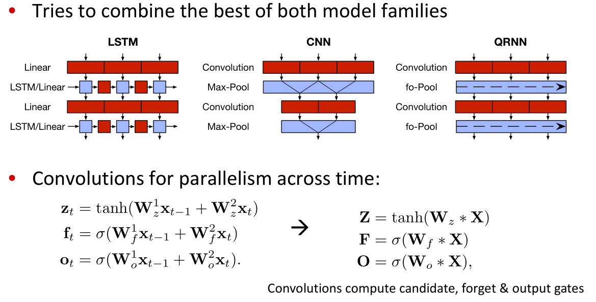

# Convolutional Networks for NLP
## From RNNs to Convolutional Neural Nets
Recurrent neural nets:

- cannot capture phrases without prefix context
    - only final representation or initial is BiLSTM
- often capture too much of last words in final vector
    - softmax is often only calculated at the last step

> CNNs with 1D convolution compute vectors for every possible word subsequence of a certain length (similar to n-grams), then group them afterwards.

## Intro to CNNs
*Translation invariance:* finding something in different places, regardless of where it appears.

To understand more of the semantics of sentence we need to see more:
- bigger kernel sizes
- dilated convolution
- increase depth of a CNN, i.e. triangular/cone view

### 1D convolution for text
*learn different latent features coming out of the text*

1D because only slides Kernel/Filter/Patch vertically, i.e. across the channels:

- rows: `kernel_size = 3`
- columns: `input_channels = 4`

Kernels specialize in different things, e.g. polite/food words.

> In convolutional models over words, kernels effectively picking n-gram units.

Sentence sort of shrunks from seven to five, so we add *padding*:


**3 channel 1D convolution with padding and pooling**
1D simply looks vertically:

- k-max pooling over time
    - top max values while keeping the original order, i.e. not sorted
- stride skips continuous rows
- dilated convolution skips between rows
    - bigger kernel without many parameters

**PyTorch**
In Conv1D, kernel slides along one dimension:
```Python
input = torch.randn(
    batch_size,
    word_embed_size,
    seq_len
)
conv1 = Conv1d(
    in_channels=word_embed_size,
    kernel_size=3,
    out_channels=3,
    padding=1
)
hidden1 = conv1(input)
hidden2 = torch.max(hiddeb1m dim=2)
```

### Example
Zhang and Wallace (2015) A Sensitivity Analysis of (and Practitioners’ Guide to) Convolutional Neural Networks for Sentence Classification


## Model comparison
- Bag of Vectors:
    - baseline for simple classification problems
    - add ReLU layers (Deep Averaging Networks)
- MLP Window Model:
    - local context e.g., POS, NER.
- Recurrent Neural Networks:
    - Cognitively plausible (reading from left to right) but slower than CNNs
    - add attention mechanisms
- CNNs:
    - need zero padding for shorter phrases
    - Efficient and versatile

## Deep CNNs
### Vertically gated units
Identity that skips a nonlinear block:

- residual block: sums values
    - learns a delta difference function
    - requires padding to keep the dimensions
- highway block: sums after T and C gates

### BatchNorm
Transform the convolution output of a batch by scaling the activations to have zero mean and unit variance, i.e. Z-transform for each mini-batch so we keep the scale after a conv block.

> less sensitive to parameter initialization, since outputs are automatically rescaled

### 1 x 1 Convolutions
Little position specific fully-connected network over channels, very few parameters at word level to modify channels.

### Quasi-Recurrent Neural Network
Modeling an association between adjacent elements at each time slice locally rather than being carried forward in one layer. Then we use deeper networks to expand the window of influence:

