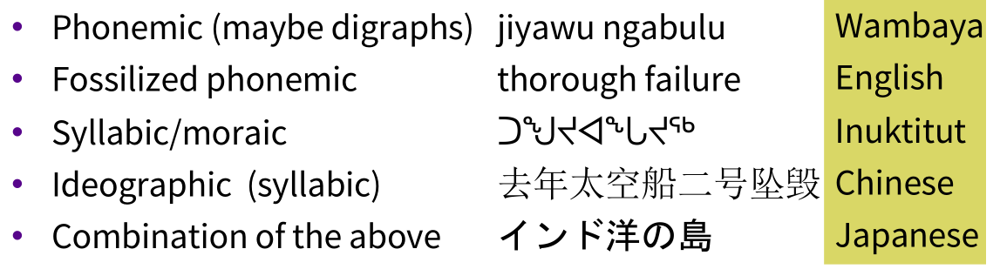
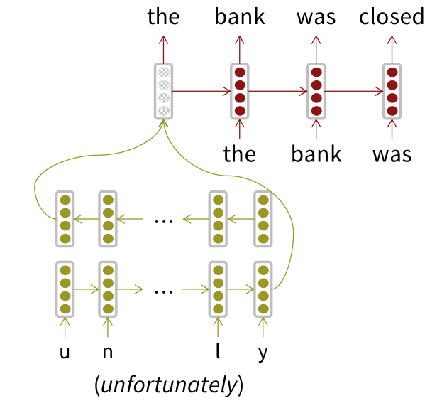
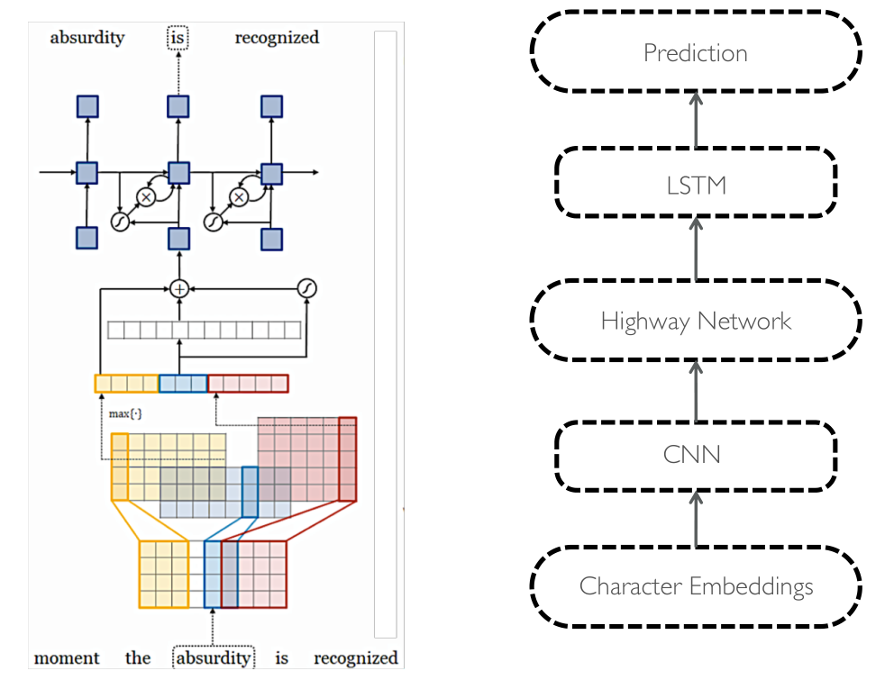
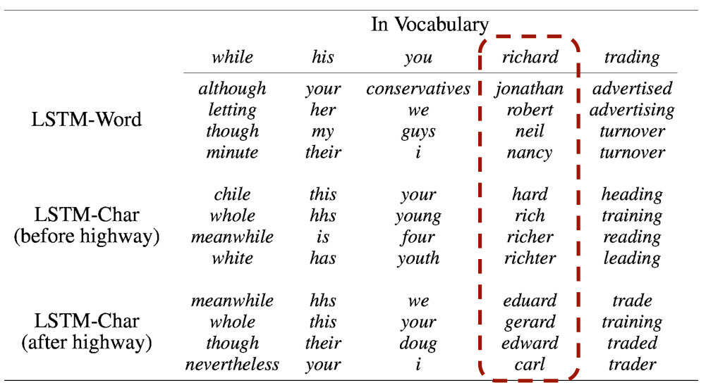

# Subword Models
*pieces with meanings*

## Character-Level Models
*Connected language can be processed as characters*

Word embeddings can be composed from character embeddings
- generates embeddings for unknown words
- similar spellings share similar embeddings
- solves out-of-vocabulary (OOV) problem

Minimum level of meaning changes:

Varying word representation:
- no word segmentation, e.g. Chinese
- clitics
- compounds

> Need to handle large, open vocabulary.

## Sub-word models
- same architecture as for word-level model but use word pieces instead
- hybrid architectures with words and characters

### Byte Pair Encoding (BPE)
*Compression: representing pieces of words*

Word segmentation algorithm done as *bottom up clustering*
1. start with unigram vocabulary of all individual letters/characters
1. find most frequent ngram pairs to create a new ngram + 1 and add to the vocabulary

We define at the beginning how many words our vocabulary has (*target vocabulary size*). Our vocabulary will have:
- all single letters because we started with them
- common subsequences of words
- common whole words

> infinite effective vocabulary while using a finite vocabulary

### Wordpiece and Sentencepiece
1. Wordpiece model tokenizes inside words
1. Sentencepiece model works from raw text
    - whitespace is retained as special token (_) and grouped normally
    - we can reverse things at end by joining pieces and recoding them to spaces

BERT e.g.
- hypatia = h ##yp ##ati ##a
- start with ## means non-initial word pieces

### Character-level to build word-level
*Start with characters, then generate word embeddings.*

Generate character vectors that together produce good word vectors to lower perplexity.

Highway layers are successfully learning how to transform those character sequence representations into something that does capture meaning.

Character level model still works with Out-of-vocabulary words:

**Hybrid NMT**
Abest-of-both-worlds architecture:
- Translate mostly at the word level
- Only go to the character level when needed

If it generates the UNK symbol:
1. take hidden representation and feed it in as the initial input into a character level LSTM
1. generate character sequence until it generates a stop symbol

## fastText
*char for word embeddings*
Word2vec extension skip-gram model with character n-grams for rare words.
