# Contextual Word Embeddings
Representations for a word is collapsing all the meanings/aspects of words, i.e. same representation (Word2vec, GloVe, fastText) but words have different behaviors dependent of the context (where it occurs). In NLM, LSTM  produce context-specific word representations at each position.

## BiLSTMs
### TagLM
Train NLM on large unlabeled corpus, rather than just word vectors:
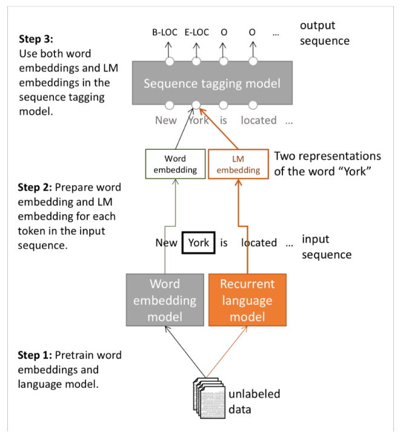
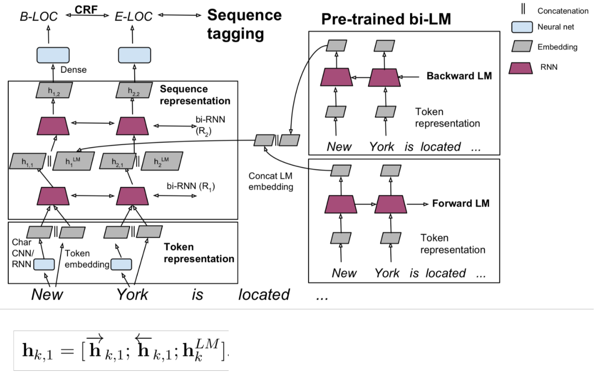

> use the word embedding (context independent) and our pre-trained/fixed trained recurrent language model (bi-LSTM) to generate hidden states as features.

### ELMo: Embeddings from Language Models
*Great for all tasks*

- use long contexts, e.g. whole sentence not context windows
- use all layers in prediction rather than just using top layer of LSTM stack

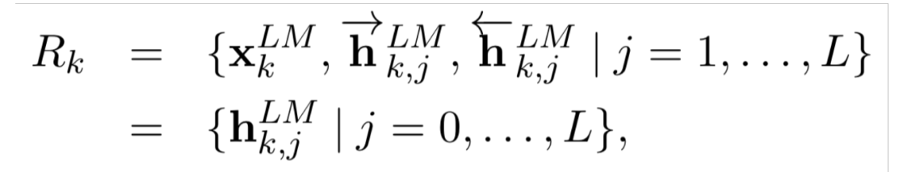
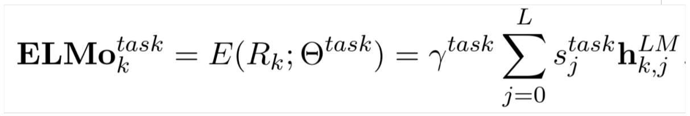
- \(y^\text{task}\): scale overall task specific usefulness of word representation

The two biLSTM NLM layers have differentiated uses/meanings:
- Lower layer is better for lower-level syntax, etc.
    - Part-of-speech tagging, syntactic dependencies, NER
- Higher layer is better for higher-level semantics
    - Sentiment, Semantic role labeling, question answering, SNLI

### ULMfit: Universal Language Model Fine-tuning for Text Classification
*Transfer learning*

Rather than just feeding features to a completely different network, they keep using the same network but they introduce a different objective at the top:
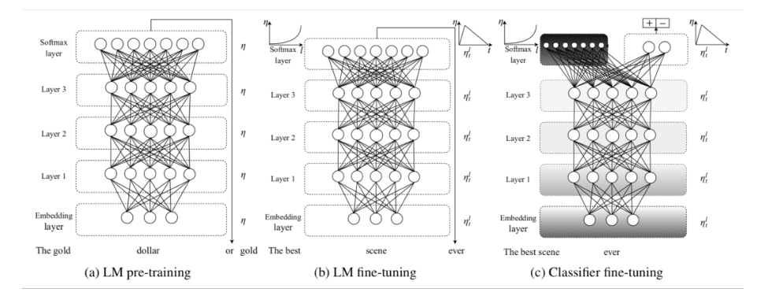
1. Train LM on big general domain corpus (use biLM)
1. Tune LM on target task data
1. Fine-tune as classifier on target task

> reusing the same network but sticking on the top of that, a different layer, to do the new classification task.

## Transformer architectures
- we want parallelization but RNNs are inherently sequential
- RNNs still need attention mechanism to deal with long range dependencies

### Attention is all you need
- Non-recurrent sequence-to-sequence encoder-decoder model
    - encoder self-attention
    - multi-head attention
- machine translation with parallel corpus

**Dot-Product Attention**
Calculate the similarity between a query \(q\) and a key \(k\) to be used as a the attention weighting factor over the corresponding values:
\[
    A(q, K, V) = \sum_i \frac{e^{q \cdot k_i}}{\sum_j e^{q \cdot k_j}} v_i
\]
- input vectors:
    - query \(q\)
    - set of key \(k\) and value \(v\) pairs
- output as weighted sum of values
    - weight fo each value: inner product between query and corresponding key

> query and keys have the same dimensionality

stack multiple queries \(q\) in matrix form \(Q\):
\[
    A(Q, K, V) = \text{softmax}(Q K^T) V
\]
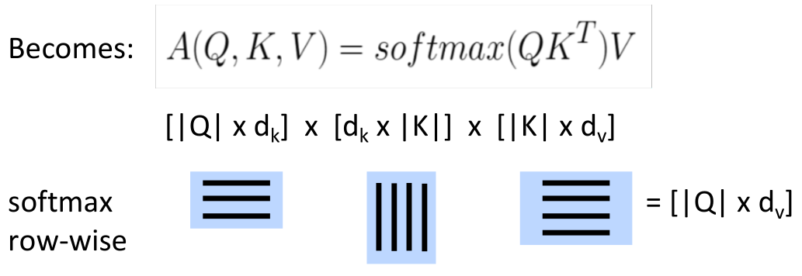

**Scaled Dot-Product Attention**
As \(d_k\) get large, the variance of \(Q^T K\) increases, then softmax gets very peaked and gradients get smaller. Scale by size/dimension of query/length vectors:
\[
    A(Q, K, V) = \text{softmax}\bigg( \frac{Q K^T}{\sqrt{d_k}} \bigg) V
\]

#### Transformer Block
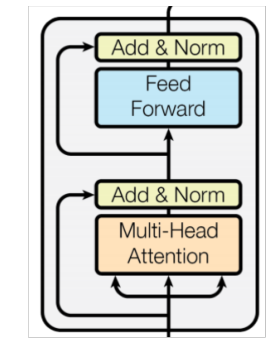
- multi-head attention
- 2-layer feed-forward with ReLu

Residual (short-circuit) connection and LayerNorm (zero mean and unit variance per layer)

**Multi-head attention**
Attend different things at the same time:
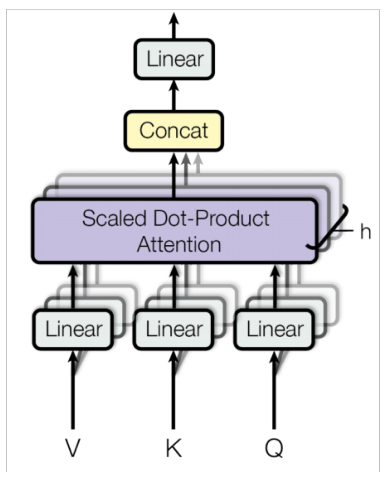
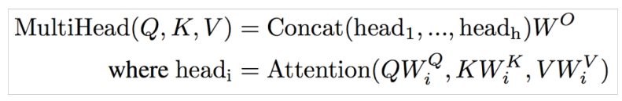
- map \(Q, K, V\) into \(h=8\) many lower dimensional spaces via \(W\) matrices
- apply attention, concatenate outputs and pass through a linear layer

#### Complete Encoder
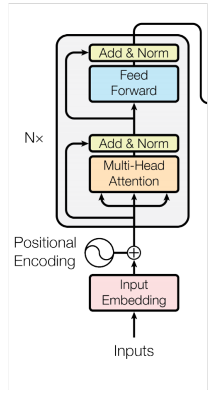

**Positional encoding**
Same words at different locations have different overall representations:
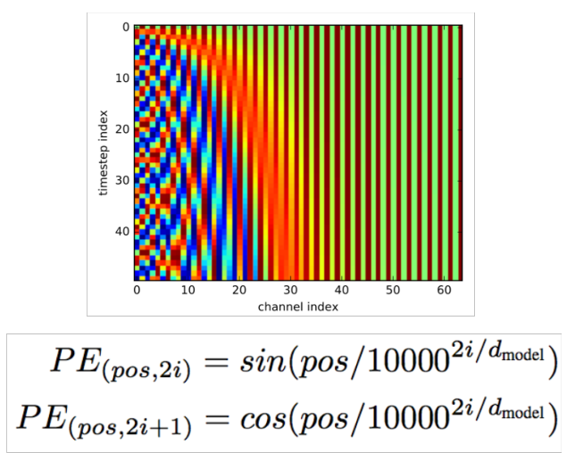

#### Complete Decoder
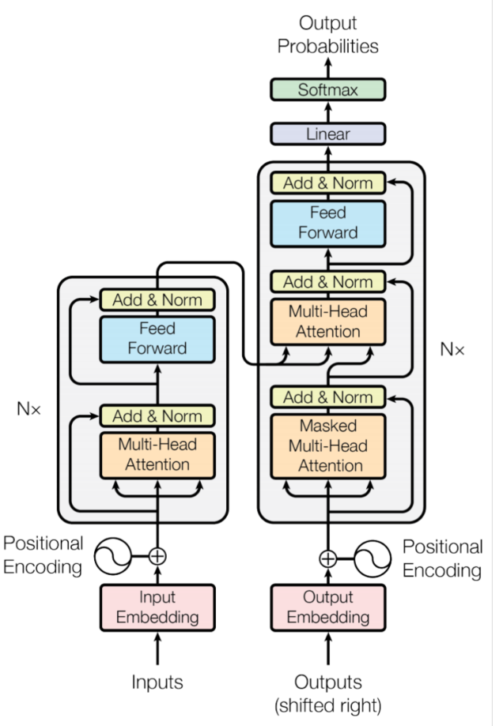
- Encoder-Decoder Attention, where queries come from previous decoder layer and keys and values come from output of encoder
- Masked decoder self-attention on previously generated outputs

### BERT: Bidirectional Encoder Representations from Transformers
*Use the transformer encoder to calculate the representation of a sentence*

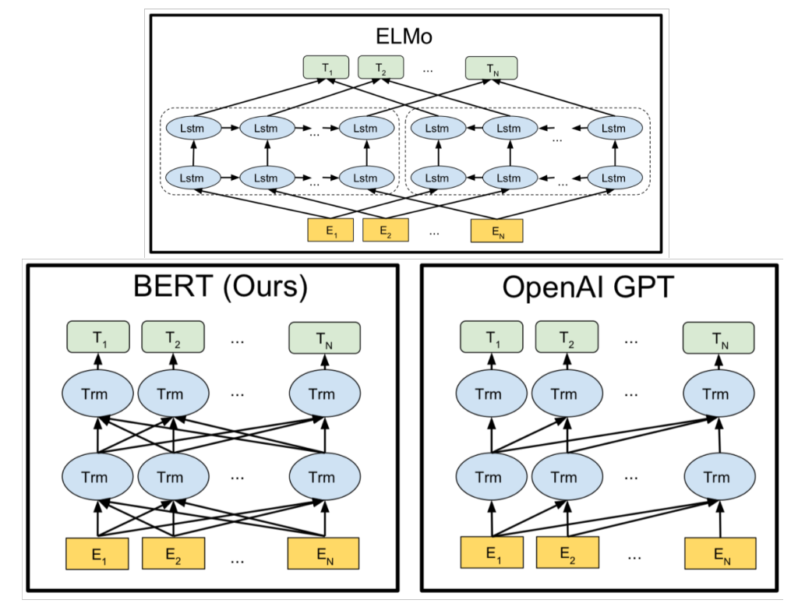
- MASK
- NSP: next sentence prediction

> Unidirectional LMs generate a well-formed probability distribution.

Simply learn a classifier built on the top layer for each task that you fine tune for.

> pre-training and size matters
