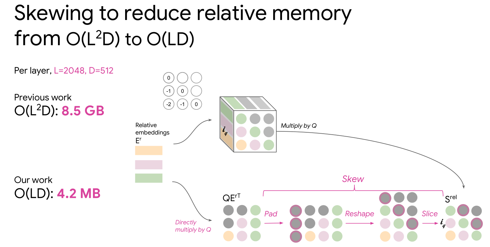

# Transformers and Self-Attention

> I'm not claiming that we arrived at an architecture that has better expressivity than an LSTM, perhaps, all we did was just build an architecture that was good for SGD.

## Self-Attention
- structure and symmetry in the dataset
- model that has the inductive biases to model these properties

Deep learning is about representation learning.

> self-attention has the ability to model inductive biases

### Learning representations of variable length data
*seq2seq learning: NMT, QA, summarization*

**Recurrent Neural Networks (RNNs)**
at each time step they produce a continuous representation as a summary of the past:

- sequential computation inhibits parallelization
- no explicit modeling of long and short range dependencies
- we want to model hierarchy

> recurrence by construction limits/inhibits parallelization because we have to wait to obtain/produce a representation (sequence aligned states)

**Convolutional Neural Networks (CNNs)**
Convolutional sequence models have limited receptive fields convolutions that consume the sequence in depth:

- parallelizable per layer
- long-distance dependencies require many layers (interaction distance)
    - linear in depth or logarithmic in dilated convolutions
- exploit local dependencies / hierarchy

> layers needed ara a function of the length of the input string / sequence

**Attention**
*content-based memory retrieval mechanism*

In NMT, decoder attends to all of the encoder content and decides what information to absorb based on how similar this content is to every position in the memory.

**Self-Attention**

- parallelizable per layer
- constant *path length* between any two positions
    - any position can interact with every position simultaneously
- softmax gating/multiplicative interactions

> models all pairwise connections

New representation based on previous layers by attending yourself/content:
1. in the beginning it's a word embedding
1. compare your content with all your word embeddings (compatibility)
1. produce a weighted combination of the entire neighborhood
1. use previous to summarize information

> re-expressing yourself in different terms based on a weighted combination of your entire neighborhood

#### Attention is Fast!
*if/when dimension dominates length*

| method | FLOPs |
| --- | --- |
| Self-Attention | \(O(\text{length}^2 \times \text{dim})\) |
| RNN (LSTM) | \(O(\text{length} \times \text{dim}^2 )\) |
| Convolution | \(O(\text{length} \times \text{dim}^2 \times \text{kernel_width})\) |

Useful:
- when dimension \(\text{dim}\) is much larger that \(\text{length}\)
- for short sequences

### Transformer

- add position representation because attention is permutation invariant
    - we can change the word position order and it's not going to affect the output
- self attention layer just recomputes the representation
    - for every position simultaneously using attention
- residual connections at every layer

The decoder is a language model using self-attention that imposes causality (*causal self-attention*) by masking the positions we can look at, i.e. it can look at the past and itself but not the future. The decoder also attends to the last layer of the encoder and at the end we use a standard cross-entropy loss.

**Encoder**
*two matmuls and a softmax*

To represent \(e_2\):
1. linearly transform \(e_2\) into a **query** vector
1. linearly transform all positions at the input (neighborhood) to a **key** vector
1. linear transformation to produce a **value** vector
1. softmax (convex combination)
1. re-express \(e_2\) in terms of previous convex combination of all the vectors (all positions)
1. linear transformation to mix information and pass it through a feed forward layer
    - \(\sqrt{d_k}\): normalize/scale the dot product

> Linear transforms as features, we're projecting these vectors into a space where the dot product is a good proxy for similarity

**Decoder**

> impose causality by using high negative values on the attention logits, i.e. zero probability on those positions by using `10e-9` in their attention logits

### Multihead Attention

- CNNs: different linear transformations based on relative distances can pick up different information at once
- Attention: same linear transformation everywhere, we're just mixing proportions (weighted average) so we can't pick out different pieces of information from different places
- Multihead attention: attention layers

For efficiency we reduce the dimensionality of all the heads (softmax) such that the amount of FLOPs don't change.

> attention layer as a feature detector using linear transformations for projection.

> Convolutions have a fixed filter that's moving around that captures relative distance

### Residual connections
Carry positional information to higher layers among other information. We just add the position informations at the input to the model and not at every layer:

## Self-Similarity, Image and Music Generation
*Motifs repeat, immediately and also at a distance and scale*

### Probabilistic Image Generation
*language model on images*

Modeling long-range dependencies with CNNs require, either:
- many layers, making training harder
- large kernals, more parameters/computational cost

> convolutions are basically local windows (translational equivariance)

Transformer architecture with pixel patches instead of words:
- Model the joint distribution of pixels
    - sequence/auto-regressive probabilistic image modeling problem
- assigning probabilities allows measuring generalization
    - maximum likelihood so we can measure perplexity

> require 2D position representations

#### Image Transformer
*Combining Locality with Self-Attention*
Restricting attention windows to local neighborhoods is a good assumption for images because of spatial locality. We make the receptive field smaller than the dimension and model longer distance dependencies than a standard convolution.

> as long as we didn't increase our length beyond the dimension, we still had a favorable computational profile.

**Local 1D attention rasterization**
Single query row-block attends to a larger memory block:

> first rows, the columns

**Local 2D attention rasterization**
matrix query block:

> blockwise and rasterized

#### Results
*the model actually capture some interesting structure and also get diversity*

In super-resolution there's a lot of conditioning information, we actually lock quite a few of the modes, i.e. only a few options you can have at the output.

### Music generation
**relative attention**

- attention compares all the queries and keys, i.e. self-similarity
- relative attention compares how far things are apart, i.e. similarity between positions

### Relative Attention
- Relative positions also achieve translational equivariance, i.e. no absolute location dependence, it's going to produce the same activation, similar to convolutions.
- Relative attention have graph inductive biases
    - self-attention imposes a fully connected / complete bipartite graph, i.e. message passing between all nodes

> Relative attention provides expressive timing, equivariance, and extends naturally to graphs.

### Less autogressive generation
The decoder still uses masked/causal attention, i.e. generating sequentially on the target side. Multi-modality prohibits naive parallel generation and sequential generation break modes. Work has been done in making the decision in a latent space.
