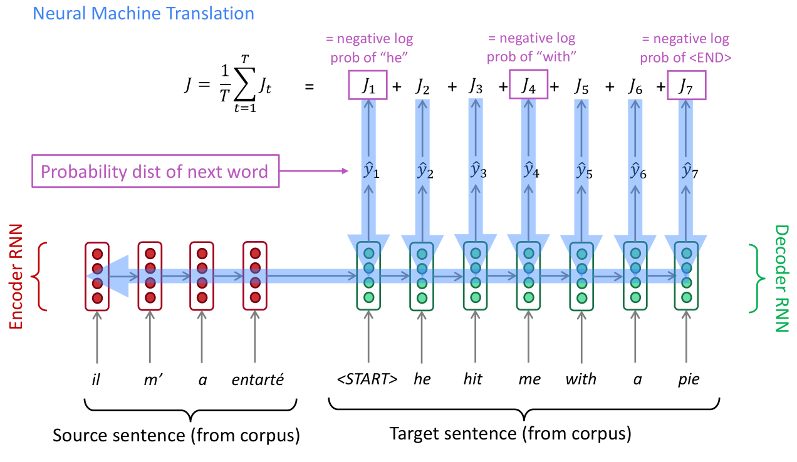
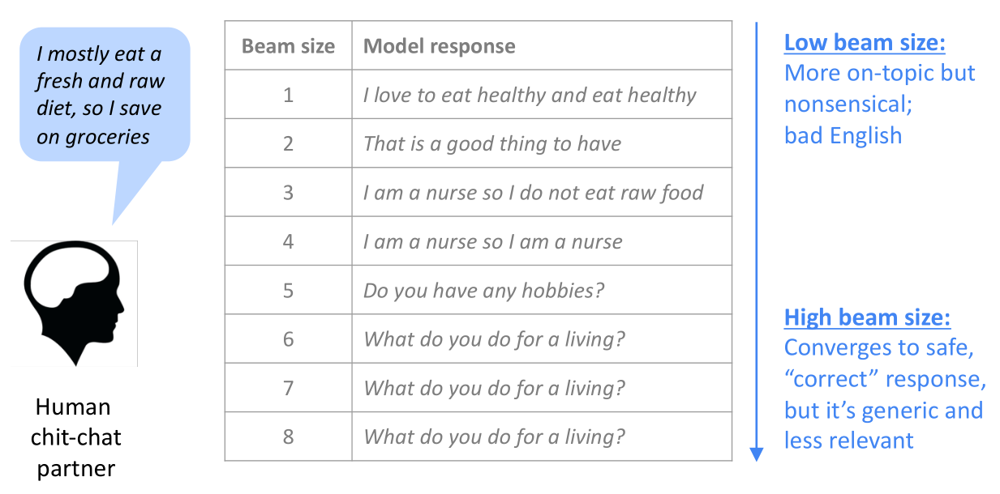
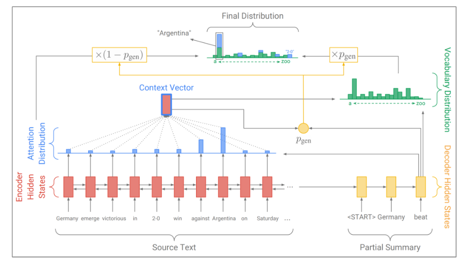
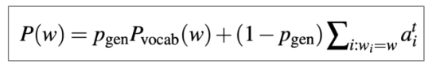
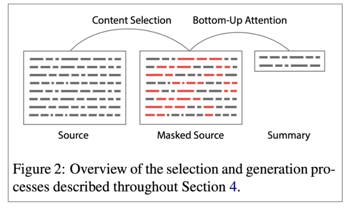
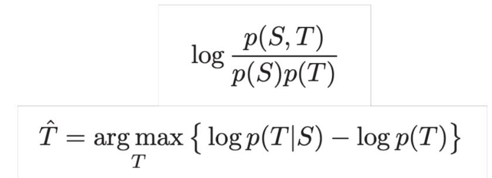

# NLG: Natural Language Generation
Subcomponent of NLP tasks:
- Machine Translation
- Summarization
- Creative writing / Dialogue
- Freeform Question Answering
- Image captioning

## Language models and decoding algorithms
**Language models**
Task of predicting the next word given the words so far, i.e. conditional probability distribution
\[
    P(y_t \vert y_1, \ldots, y_{t-1})
\]

**Conditional Language Modeling**
Predicts the next word given the past and some other input \(x\):
\[
    P(y_t \vert y_1, \ldots, y_{t-1}, x)
\]

Examples of conditional language modeling tasks:
- Machine Translation (x=source sentence, y=target sentence)
- Summarization (x=input text, y=summarized text)
- Dialogue (x=dialogue history, y=next utterance)

### Training a conditional RNN-LM
During training we feed the target into the decoder, regardless of what the decoder predicts (*Teacher Forcing*):

### Decoding/Search algorithm
*generate text from your language model*
- greedy decoding: simple method with low quality output
- beam search: better quality but high \(k\) returns high-probability generic and short output
- sampling: efficient algorithm where diversity and randomness is controlled by truncating the probability to top \(n\) words
- softmax temperature: test time technique that can be used alongside any decoding algorithm

**Greedy decoding**
1. on each step, take the most probable word (i.e. argmax) as the next word input
1. until you produce <END> (or reach some max length)

> due to lack of backtracking (correct mistakes), output can be poor (e.g. ungrammatical, unnatural, nonsensical)

**Beam search**
Find a high-probability sequence (not necessarily the optimal sequence) by tracking multiple possible sequences at once:
1. on each step,keep track of the beam size \(k\) most probable partial sequences (*hypotheses*)
1. until stopping criterion, choose the sequence with the highest probability adjusted by length

Changing beam size \(k\):
- small \(k=1\): greedy decoding
    - unnatural, nonsensical
- larger \(k\); considers more hypotheses
    - decreases BLEU score due to short translations, even with score normalization
    - makes output more generic, i.e. converges to high probability

- small \(k\): bad english
- large \(k\): generic

**Sampling-based decoding**
*instead of argmax*
On each step \(t\), randomly sample from the probability distribution \(p_t\) to obtain the next word. *Top-\(n\) sampling* restricts to the top \(n\) most probable words, i.e. truncates the probability distribution:
- \(n=1\): greedy search, truncates to the top/max probability
- \(n=\vert V \vert\): pure sampling, considers all possibilities (no truncation)

Increase \(n\) for diverse/risky output rather than generic/safe.

> more efficient than beam search because there are no multiple hypotheses.

**Softmax temperature**
*at test time*
Language model computes a probability distribution \(p_t\) by using a softmax function to a vector of scores *logits* \(s \in \mathbb{R}^{\vert V \vert}\). We can apply a *temperature* hyperparameter \(\tau\) to the softmax function by just dividing all scores:
\[
    P_t(w) = \frac{\exp(s_w / \tau)}{\sum_{w' \in \vert V \vert} \exp(s_{w'} / \tau)}
\]
- higher \(\tau\): probability distribution \(P_t(w)\) becomes more uniform, i.e. it melts
    - more diverse output because probability is spread around vocabulary
- lower \(\tau\): probability distribution \(P_t(w)\) becomes concentrated/spiky
    - less diverse output because probability is concentrated on top words

> technique applied at test time in conjunction with a decoding algorithm, e.g. beam search or sampling

## NLG Tasks
### Neural summarization
- [Python implementation of ROUGE](https://github.com/google-research/google-research/tree/master/rouge)
- [list of summarization datasets, papers, and codebases](https://github.com/mathsyouth/awesome-text-summarization)
- [A Survey on Neural Network-Based Summarization Methods, Dong, 2018](https://arxiv.org/pdf/1804.04589.pdf)

Given input text \(x\) (single/multiple document) write a short version \(y\).
- extractive: select sentences of the original text to form a summary, i.e. highlight with a marker
    - easier but restrictive (no paraphrasing)
- abstractive: generate new text
    - more difficult but flexible

#### ROUGE: Recall-Oriented Understudy for Gisting Evaluation
*recall based summarization evaluation*

Like BLEU, it’s based on n-gram overlap but with some differences:
- based on recall, while BLEU is based on precision
    - precision is more important for machine translation
    - recall is more important for summarization
- BLEU has brevity penalty to fix under-translation, ROUGE has no brevity penalty
- BLEU is reported as a single number, which is combination of the precisions for n=1,2,3,4 n-grams. ROUGE scores are reported separately for each n-gram
    - ROUGE-L: longest common subsequence overlap

#### Copy mechanisms
*Making it easier to copy but also preventing too much copying!*

Copy mechanisms use attention to enable a seq2seq system to easily copy words and phrases from the input to the output:

- \(p_\text{gen}\): probability of generating the next word (rather than copying it)
    - based on current decoder hidden state
- \(1 - p_\text{gen}\): probability of copying
- \(P(w)\): final output distribution for the next word
    - probability of generating, times, the probability of what we would generate \(P_\text{vocab}\)
    - probability of copying what we're attending

**Problems**
- they copy too much, e.g. long phrases / whole sentences
- no overall strategy for selecting content

Pre-neural summarization had separate stages for content selection and surface realization (i.e. text generation). In a standard seq2seq+attention summarization system, these two stages are mixed in together: On each step of the decoder (i.e. surface realization), we do word-level content selection (attention).

> better to first select then generate and not mix in a single step

#### Bottom-up summarization

1. content selection stage
    - tag words as include or not
1. bottom-up attention stage
    - attend only to tagged words (mask)

Less copying of long sequences (i.e. more abstractive output)

#### Neural summarization via Reinforcement Learning
Use Reinforcement Learning (RL) to directly optimize ROUGE-L. Using RL instead of ML achieved higher ROUGE scores, but lower human judgment scores.

> gaming the metric and not optimizing for the true task.

### Dialogue
Task-oriented dialogue:
- Assistive: e.g. customer service, giving recommendations, question answering
- Adversarial/Co-operative: agents compete/solve a task together through dialogue

Social dialogue:
- Chit-chat (for fun or company)
- Therapy

**Serious pervasive deficiencies**:
- Irrelevant responses (not sufficiently related to context)
- Genericness / boring responses
- Repetition
- Lack of context (not remembering conversation history)
- Lack of consistent persona

#### Irrelevant responses
Unrelated to user’s utterance
- generic (e.g. “I don’t know”)
- changing the subject to something unrelated

Maximum Mutual Information (MMI) between input S and response T:

- ratio: probable given the input \(S\) but if \(T\) on its own is high, then it gets penalized (generic response)

#### Genericness / boring response problem
Test-time fixes:
- Directly upweight rare words during beam search
- or, sampling decoding algorithm rather than beam search
- or, softmax temperature

Conditioning fixes:
- Condition the decoder on some additional content
- Train a retrieve-and-refine model rather than a generate-from-scratch model

#### Repetition problem
- Directly block repeating n-grams during beam search.
- Train a coverage mechanism
    - prevents the attention mechanism from attending to the same words multiple times
- Define a training objective to discourage repetition using RL

#### Conversational question answering: CoQA
Answer questions about a piece of text within the context of a conversation

#### Storytelling
- Generate a story-like paragraph given an image
- Generate a story given a brief writing prompt
- Generate the next sentence of a story, given the story so far (story continuation)

## NLG evaluation
### Automatic evaluation metrics for NLG
- Word overlap based metrics (BLEU, ROUGE, METEOR, F1, etc.) are not ideal for open ended systems.
- Perplexity captures how powerful your LM is, but doesn’t tell you anything about generation.

We can define more focused automatic metrics to capture particular aspects of generated text:
- Fluency (compute probability w.r.t. well-trained LM)
- Correct style (prob w.r.t. LM trained on target corpus)
- Diversity (rare word usage, uniqueness of n-grams)
- Relevance to input (semantic similarity measures)
- Simple things like length and repetition
- Task-specific metrics e.g. compression rate for summarization

> these don’t measure overall quality, they can help us track some important qualities

## NLG future research
- Incorporating discrete latent variables into NLG
- Alternatives to strict left-to-right generation (iterative refinement)
- Alternative to maximum likelihood training with teacher forcing
    - sentence-level rather than word-level objectives

**8 things I’ve learnt from working in NLG**
1. The more open-ended the task, the harder everything becomes.
    - constraints are sometimes welcome
1. Aiming for a specific improvement can be more manageable than aiming to improve overall generation quality.
1. improving the LM (i.e. perplexity) will most likely improve generation quality.
    - but it's not the only way to improve generation quality.
1. Look at your output, a lot
1. probably need several automatic metrics
1. If you do human eval, make the questions as focused as possible
1. Reproducibility is a huge problem
1. Working in NLG can be very frustrating. But also very funny
