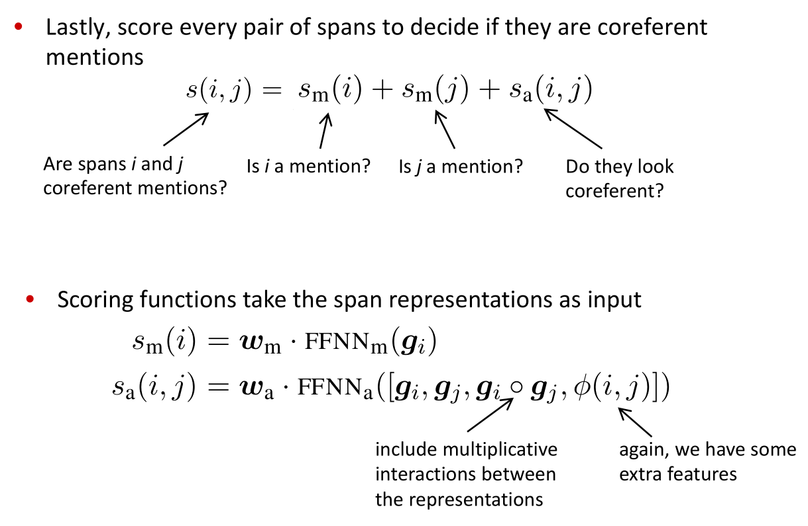

# Coreference Resolution
*Identify all mentions that refer to the same real world entity*

Coreference Resolution in Two Steps:
1. Detect the mentions
1. Cluster the mentions

A related linguistic concept is *anaphora*: when a term (anaphor) refers to another term (antecedent) / textual dependence.

## Algorithm
- Rule-based (Hobbs Algorithm)
- Mention-pair models
    - binary classifier for coreferent from left to right through the text.
    - transitive cluster adds extra links
- Mention ranking models
    - only add highest scoring coreference link (softmax)

## End-to-end Model

- span’s start and end: Represents the context to the left and right of the span
- Attention-based representation: Represents the span itself
- Additional features: Represents other information not in the text

## Clustering-Based
*agglomerative clustering*

1. Start with each mention in it’s own singleton cluster
1. Merge a pair of clusters at each step
    - use a model to score which cluster merges are good

> Evaluation metrics: MUC, CEAF, LEA, B-CUBED, BLANC
