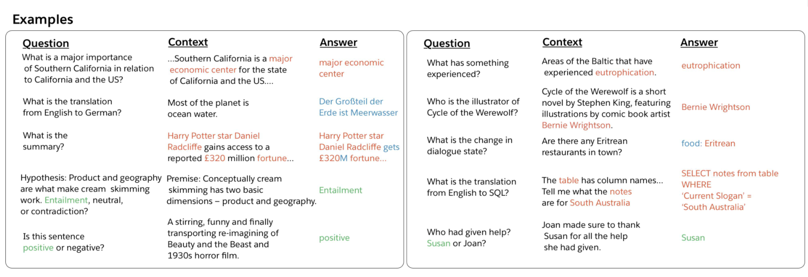
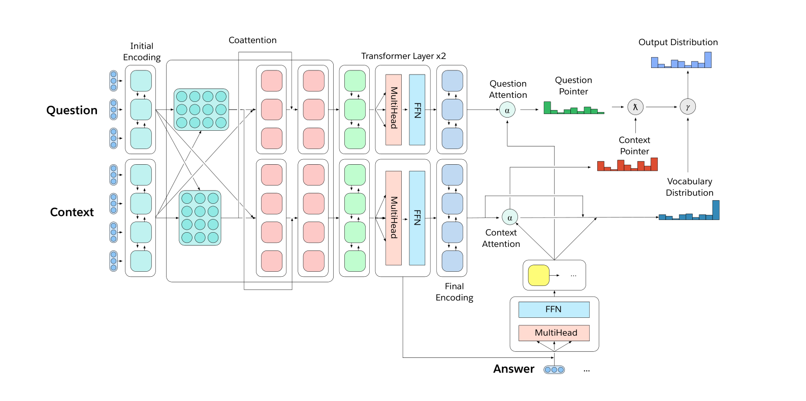

# Multitask Learning

BERT is basically a separate model for different tasks because you have different CLS token with a different top layer. Tere's a lot of extra tuning for each of the data sets and tasks, e.g. different learning rate, different size and so on.

## The Natural Language Decathlon (decaNLP)
A single system to perform ten disparate natural language tasks, decaNLP offers a unique setting for multitask, transfer, and continual learning.

### Tasks

### Multitask Question Answering Network (MQAN)
Output a word from vocab, context pointer or question pointer:

- catastrophic interference
    - train two different tasks in the same model but they hurt each other's performance
- catastrophic forgetting
    - first train in one task then on a second task and basically the first task will be completely forgotten

### Training Strategies
- Fully joint
    - take a mini-batch from each of the different tasks, i.e. train each task separately
- Anti-curriculum pre-training / decreasing order of difficulty
    - difficulty: how many iterations to convergence in the single-task setting
    - i.e. from general pre-training to simpler tasks

> Machine Translation (MT) was hardest becaus it had a large Softmax vocabulary of words that were in no other task, for that we always include MT task because it needs more training.
