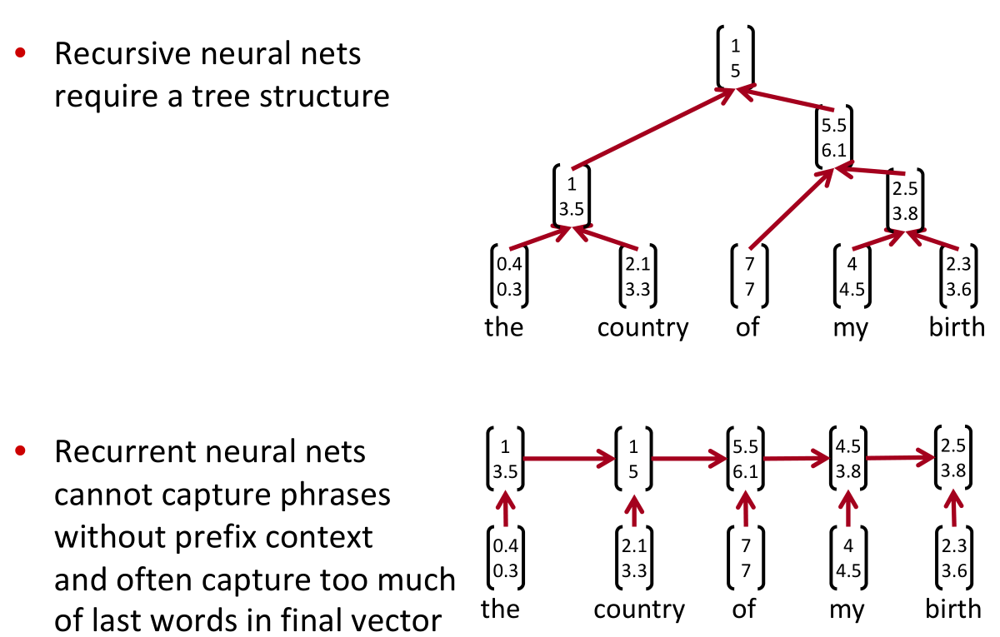

# Constituency Parsing TreeRNNs
*Tree Recursive Neural Networks, Constituency Parsing, and Sentiment*

**principle of compositionality:**
The meaning (vector) of a sentence is determined by:
1. the meanings of its words and
1. the rules that combine them

> map phrases into a vector space

## Recursive Neural Networks

