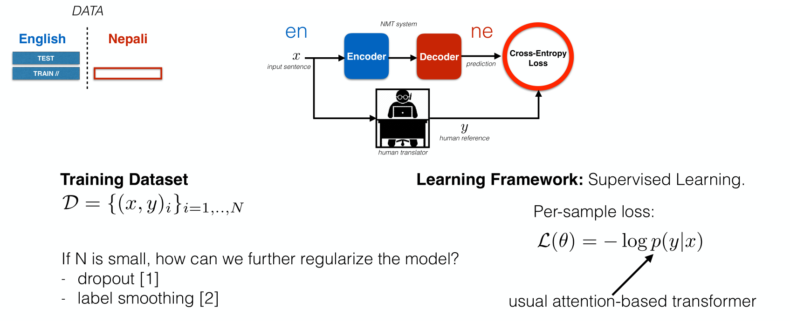
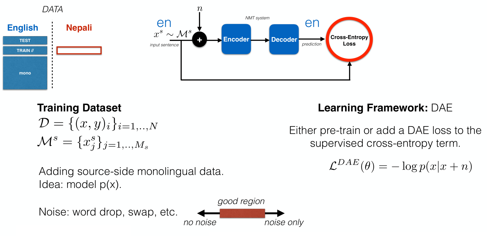
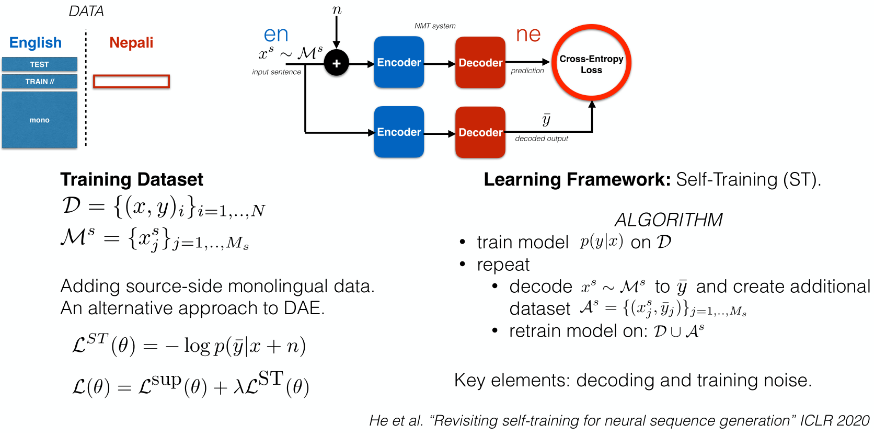
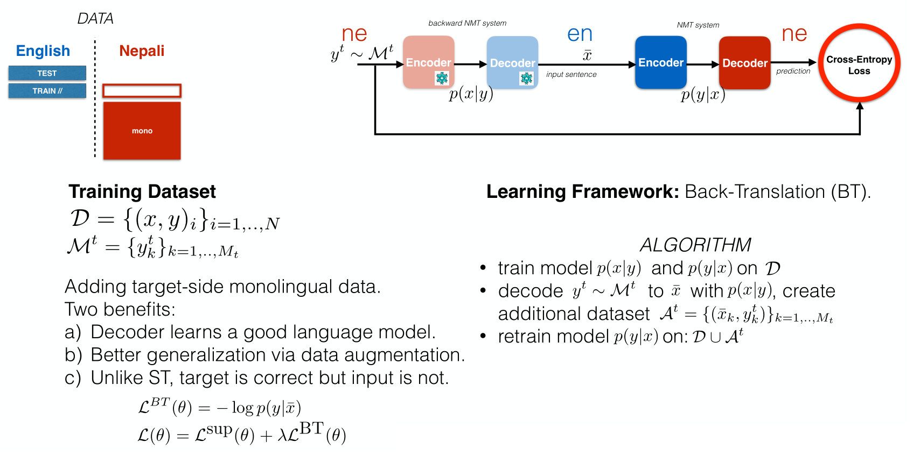
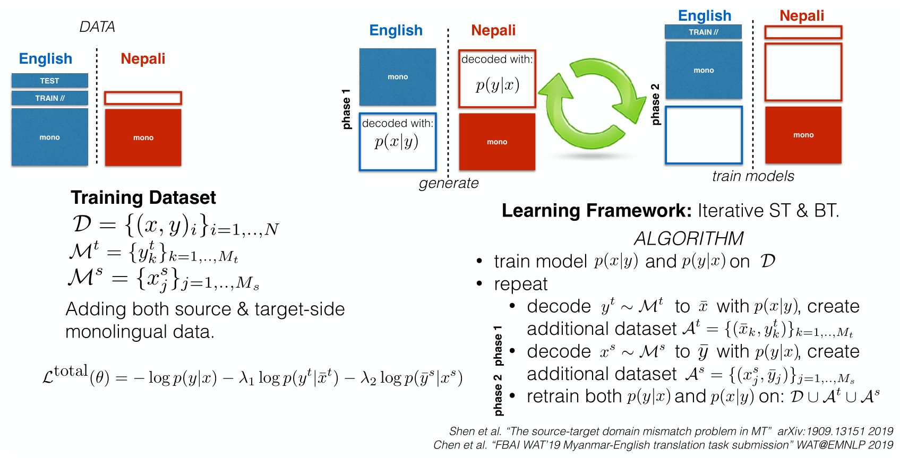
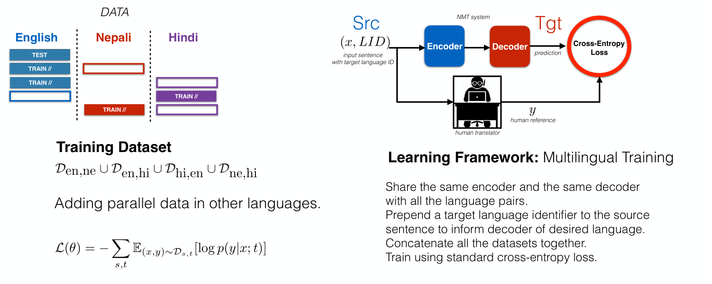
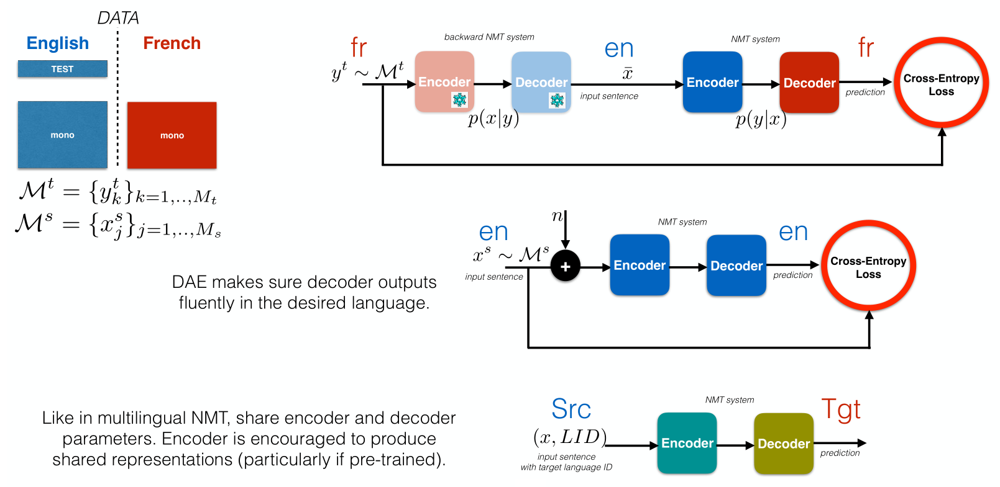

# Marc'Aurelio Ranzato: Low Resource Machine Translation
*learning with less labeled data.*

Parallel data as translation from english (source) to french (target) by minimizing the cross-entropy loss (maximizes the log-probability).
- amount of data of parallel correlates with the quality of translation
- for low resource languages, there is not much parallel data, at most some in domain monolingual data

> A language pair can be considered low resource when the number of parallel sentences is in the order of 10,000 or less.

## Supervised Learning

## Semi-Supervised Learning
### Denoising AutoEncoder
The decoder Encoder-Decoder operates in english for training but for translation we only use the encoder part:

- \(\mathcal{M}^s\): monolingual source
- \(n\): level of noise
    - low: trivial task, we can simply copy the input
    - high: we destroy the input

> we can pre-train the encoder or use it as an auxiliary loss in supervised learning

### Self-Training
Loss between current and old/stale version:

1. First train your machine translation system on the parallel data
1. repeat the following process
    1. decode your monolingual dataset using your current machine translation system and make a new parallel data set of sentences from with the translations
    1. retrain the model on the union of your original parallel data plus this auxiliary data set

 > two hyper-parameters: noise level and the weight of the auxiliary dataset

### Back-Translation
The targets are clean but the input \(\bar{x}\) is noisy for regularization:

1. train a translation system on the parallel data
1. decode the target side monolingual dataset to produce an auxiliary parallel dataset
1. concatenate the two datasets: original and auxiliary
1. train a new model

**Combination**

1. generate from monolingual:
    - decode/translate the source-side monolingual data into decoded/translated Nepali
    - translate the target-side monolingual dataset into decoded english
1. train models
    - concatenate with parallel data
    - retrain
1. iterate by generation and training

### Multi-Task
In many languages a fraction of the dictionary is shared. Parallel datasets on different language pairs where a token LanguageID (LID) specifies the language in which you want to translate:

## Unsupervised Machine Translation
*only monolingual and no parallel data*

We have a single encoder and a single decoder shared so we specify the target language by an extra token at the input:

1. Iterative Back Translation
1. Denoising AutoEncoder (DAE)
1. Multi-lingual task

The more the domains are different and the more the languages are different from each other the worst it gets so we need an anker point with lots of data, e.g. English-Hindi has a lot of supervision. The combination of bad translation and multilingual training is here the winning combination.

## Source-Target Domain Mismatch (STDM)
*same topic different distribution over words*

Source & target geographic locations are typically farther apart and cultures have more distinct traits.

## Filtering
*learn a joint embedding space*

Using much more data although noisy you can do better than using a curated high quality dataset.

## Summary
- Diversity of domains and varying translation quality/size.
- In general, DAE pretraining, (iterative) BT and multi-lingual training perform strongly on low resource languages.

Working low resource machine translation doesn't mean training small models on small data but actually means training even bigger models on even more data because you need to compensate for the lack of supervision from a parallel dataset.

> Low resource MT key idea: use as many auxiliary tasks and data.
