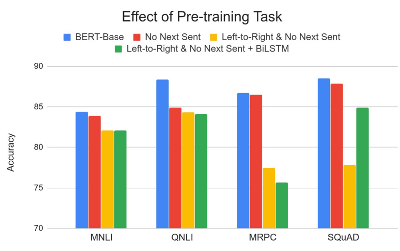
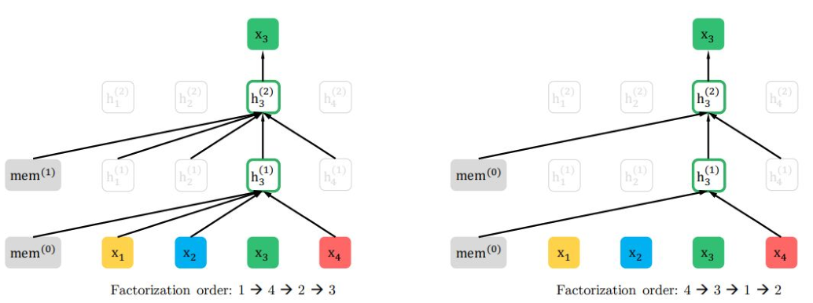

# BERT and Other Pre-trained Language Models
*Contextual Word Representations*

The rule of thumb that you're going to overfit your data if you only have a few labeled examples turns out not to really be true anymore.

> The ultimate goal of research is research yourself out of a job

## History and Background
Word embeddings are the basis of deep learning for NLP:

- embedding: lookup table from a set of discrete vocabulary to a vector that's learned discriminatively end to end

Word embeddings (word2vec, GloVe) are often pre-trained on text corpus from co-occurrence statistics:

- problem: applied in a context free manner later

Same embedding:

> almost any word has a different meaning depending on the context

Train contextual representations on text corpus:

- ELMo: Deep Contextual Word Embeddings
    - train separate Left-to-Right and Right-to-Left LMs and concatenate to use as pre-trained Embeddings
- GPT1: Improving Language Understanding by Generative Pre-Training
    - train 12-layer Transformer LM and finetune by taking the last token to use as pre-trained embeddings

### Transformer Encoder

- multi-head self-attention
- feed-forward layers
    - compute non-linear hierarchical features
- layer-norm and residual connections
- positional embeddings

**Transformer vs. LSTM**
- no locality bias given self-attention
    - long-distance context has equal opportunity
- efficiency on TPU: single multiplication per layer
    - batch size is number of words, not sequences.

### BERT
*language understanding is bidirectional*

Language models only use left context or right context (unidirectional):
- directionality is needed to generate a well-formed probability distribution
- build representation incrementally

In a bi-directional context encoder, words can see themselves after the first layer (no actual prediction)

- bidirectional: there is a path back to the input word token / *cheating*

**Masked LM**
Mask out \(k%\) of the input words and then predict them:

> no cheating because the words aren't in the input

Not as many predictions per sentence, only \(k%\) instead of \(100%\) but better representations:
- Too much masking, e.g. \(50%\) : Not enough context
- Too little masking: Too expensive to train

The [MASK] token is never seen at fine-tuning, so instead:

Predict \(k=15%\) of the input words but
- [MASK]: 20%
- keep: 10%
- replace: 10%
    - this is corrupting the data

The advantage of this procedure is that the Transformer encoder does not know which words it will be asked to predict or which have been replaced by random words, so it is forced to keep a distributional contextual representation of every input token.

> model must be able to maintain a good representation

**Next Sentence Prediction**
*learn to predict relationship between sentences*

Predict whether Sentence B is actual sentence that proceeds Sentence A, or a random sentence:

- `isNextSentence`: same document
- `NotNextSentence`: other random document

**Input Representation**
Each token is sum of three embeddings:

- token embeddings: 30,000 WordPiece vocab
    - [CLS] token is trained to predict the next sentence / classification task
    - 256 sequences * 512 length = 131,072 words
- segment/sequence/type embeddings: sentenceA or sentenceB
- absolute position embeddings

#### Fine-tuning Procedure
Fine-tuning the entire model, is not really that the [CLS] is intrinsically useful but the weights inside the entire model are useful:

> fine-tuning the entire model for some downstream task

Jointly train old (fine-tune) and new parameters:

> because the vast majority of the parameters are pre-trained we adapt in only a few thousand labeled examples

#### Effect of Pre-training task

- next sentence prediction: important for question answering
- left-to-right and no-next-sent: GPT1 is bad for SQuAD because it has no context
    - adding BiLSTM helped if enough labeled data

> MASK LM is the most important task

**Effect of Directionality and Training Time**
Absolute results are much better almost immediately:

Slightly longer to converge on the first steps because we only predict 15% instead of 100%

> Masked-LM converges to a better point

**Effect of Model Size**
Big models help a lot:

> improvements have not asymptoted (no limit)

## Open Source Release
One reason for BERT’s success was the open source release:
- Minimal release (not part of a larger codebase)
- No dependencies but TensorFlow (or PyTorch)
- Abstracted so people could including a single file to use model
- End-to-end push-button examples to train SOTA models
- Thorough README
- Idiomatic code
- Well-documented code
- Good support (for the first few months)

## Post-BERT Pre-training Advancements

There's not really many companies that have the resources to train these huge state-of-the-art models and so almost by necessity it's gonna it's gonna come from one of these labs.

### RoBERTa: A Robustly Optimized BERT Pretraining Approach
*BERT was very undertrained*

- trained BERT for more epochs and/or on more data
- improved masking and pre-training data slightly

### XLNet: Generalized Autoregressive Pretraining for Language Understanding
**Relative position embeddings**
*generalizes much better for longer sequences*

> absolute position embedding are not optimal once we get to larger sequences.

**Permutation Language Modeling**
In a left-to-right language model, every word is predicted based on all of the words to its left, instead, randomly permute the order for every training sentence:

Equivalent to masking, but many more predictions per sentence.

> probability distribution because it's still predicting one word at a time given some permutation of the input.

### ALBERT: A Lite BERT for Self-supervised Learning of Language Representations
*ALBERT is light in terms of parameters, not speed*

We can reduce the number of parameters but still nobody's figured out how to reduce the amount of pre-training compute that required.

**Factorized embedding parameterization**
Use small embedding size (e.g., 128) and then project it to Transformer hidden size (e.g., 1024) with parameter matrix:

> parameter reduction

**Cross-layer parameter sharing**
- share all parameters between Transformer layers

### T5: Exploring the Limits of Transfer Learning with a Unified Text-to-Text Transformer
Ablated many aspects of pre-training:
- Model size
- Amount of training data
- Domain/cleanness of training data
- Pre-training objective details (e.g., span length of masked text)
- Ensembling
- Finetuning recipe (e.g., only allowing certain layers to finetune)
- Multi-task training

**Conclusions**
- scaling up model size and amount of training data helps a lot
- exact percent of masking/corruptions strategy doesn’t matter that much

> all that really matters is making the model bigger and more clean data

### ELECTRA: Pre-training Text Encoders as Discriminators Rather Than Generators
*better sampling efficiency*

Train model to discriminate locally plausible text from real text:

## Distillation: model compression
*serving models*

**Applying Models to Production Services**
- BERT and other pre-trained language models are extremely large and expensive
- How are companies applying them to low-latency production services?

### Technique
*compression with no degradation*
1. teacher: pre-trained LM fine tuned to maximum accuracy
    - use to label a large amount of unlabeled examples, i.e. pseudo label
1. student: 50x smaller model trained to mimic teacher output
    - minimize MSE or CrossEntropy

> not actually compressing the pre-trained model itself, we need a task

Distillation works much better than pre-training + fine-tuning with smaller model:

- 50k labeled examples, 8M unlabeled examples

> still need to train the big model in the first place

### Why does distillation work so well?
*A hypothesis*
- Language modeling is the “ultimate” NLP task in many ways
    - i.e., a perfect language model is also a perfect question answering/entailment/sentiment analysis model
- Training a massive language model learns millions of latent features which are useful for all NLP tasks
    - This requires an oversized model
- Finetuning mostly just picks up and tweaks these existing latent features
    - Distillation allows the model to only focus on those features

> supporting evidence: Simple self-distillation (distilling a smaller BERT model) doesn’t work

## Conclusions
- Pre-trained bidirectional language models work incredibly well
- However, the models are extremely expensive
- Improvements (unfortunately) seem to mostly come from even more expensive models and more data
- The inference/serving problem is mostly *solved* through distillation
